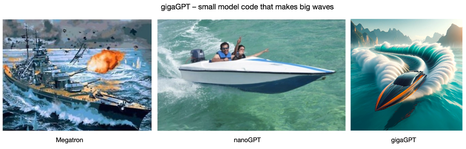
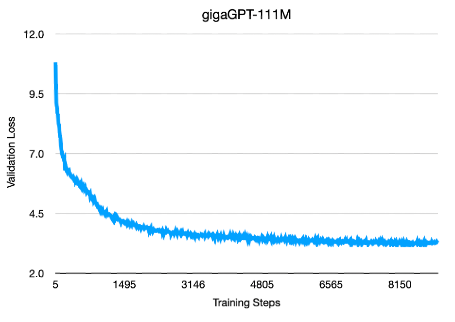
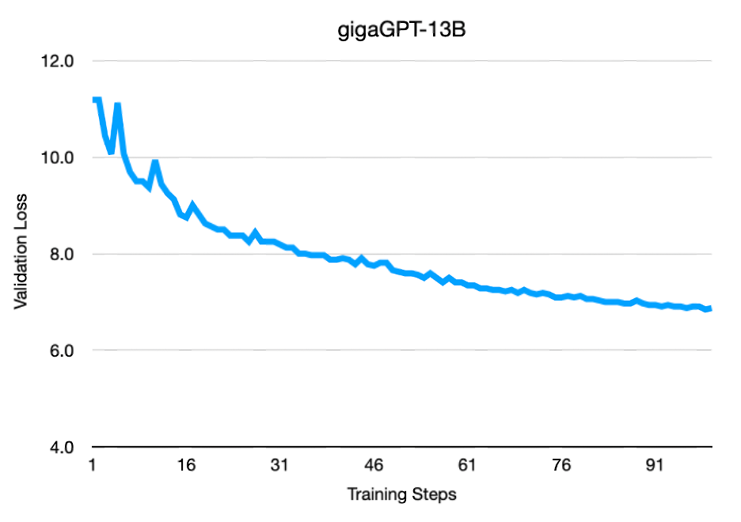
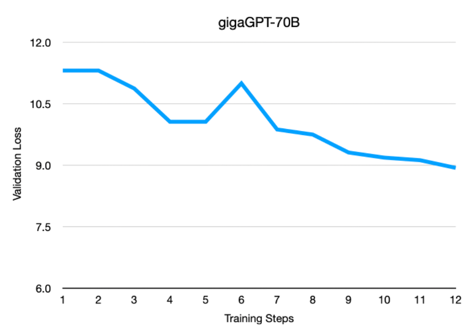

# gigaGPT



We present gigaGPT – the simplest implementation for training large language models with tens or hundreds of billions of parameters. This work was inspired by Andrej Karpathy's [nanoGPT](https://github.com/karpathy/nanoGPT/tree/master). However, while nanoGPT is designed to train medium sized models up to around the 1B parameter range, gigaGPT leverages Cerebras hardware to use a single simple model definition and training loop to scale to GPT-3 sized models run across exaflop scale clusters. See our [technical blog](https://www.cerebras.net/blog/gigaGPT) for a detailed overview.

As in nanoGPT, the main training logic is split between [`train.py`](./train.py) and [`model.py`](./model.py), with a total of 565 lines of simple, readable pytorch code combined. While nanoGPT can replicate GPT-2, gigaGPT is built to be able to replicate something of the scale of GPT-3 (albeit possibly with a dataset upgrade compared to the nanoGPT support). We have tested that models up to 175b parameters in size run functionally correctly at high throughput and have no reason to suspect that you can't scale significantly larger.
While this code will run on CPU or GPU without errors for small models, it only really shines to its full potential when run on Cerebras hardware. The combination of the scale of the hardware, the weight streaming execution mode, and the data parallel scale-out across machines is what provides the magic required for easy scale-out to larger models and larger clusters.

## Models

| Parameters | Layers | Width | Heads | Learning Rate | Sequence Length | Batch size (seq) |
| ---------- | ------ | ----- | ----- | ------------- | --------------- | ---------------- |
| 111M       | 10     | 768   | 12    | 6.0e-4        | 2048            | 120              |
| 13B        | 40     | 5120  | 40    | 1.2e-4        | 2048            | 1080             |
| 70B        | 80     | 8192  | 64    | 1.0e-6        | 2048            | 1472             |
| 175B       | 96     | 12288 | 96    | 5.0e-6        | 2048            | 1472             |

gigaGPT implements the basic GPT-2 architecture in a way that matches nanoGPT. In particular, we use learned position embeddings, standard attention, and biases throughout the model, although this choice was primarily to stick closely to nanoGPT, and these things could all be easily changed. We validate gigaGPT by training four models with 111M, 13B, 70B, and 175B parameters. Details are presented in the table above. All the models tested use the OpenWebText dataset using the GPT-2 tokenizer with preprocessing code taken from nanoGPT. As the goal of this project was to create a clean, performant, and usable code base for others to use rather than to train state of the art models ourselves, our validation was geared towards functional correctness rather than convergence, downstream performance, or other similar metrics.

The configurations for these models are provided in the `configs` directory. The models from 111M to 13B take their dimensions, learning rates, batch sizes, and training schedules from CerebrasGPT, compared to which they differ primarily in dataset. The 70B configuration is losely inspired by Llama-2 70B and gets its model dimensions, 2T token training schedule, and approximate batch size from that work. The 175B configuration takes the 70B configuration and modifies its model dimensions to match what was reported in the original GPT-3 paper, adjusting learning rate and initializations accordingly in line with common heuristics. Again we emphasize that these models are meant to demonstrate the scaling and performance of the model code rather than training to completion. Users will likely have to choose hyperparameters more carefully if they intend to do large-scale training runs, especially for the 70B and 175B models.

Here are some training curves from start of the runs of three of these configs. Due to computational limitations we don't run all of them to convergence.







## Quick start

### Environment setup
To create your python environment, simply run `pip install -r requirements.txt`. We suggest you do this
from a virtual environment. The `requirements.txt` file contains seven simple dependencies, of which `cerebras_pytorch` is the only one which isn’t already widely used in the open-source community.

### Download the datasets
The first step is to generate the training data. The data preprocessing code is taken directly from nanoGPT
and is quite simple. For example, to preprocess OWT, run

```bash
python data/openwebtext/prepare.py
```

Each individual dataset directory has a README describing some basic characteristics of it. The smaller
datasets are nice for debugging and toy runs (for example if all you have is a CPU), but if you're
running any of the configurations provided with this repo you'll want open web text.

### Update the configuration files
Each configuration file has a few placeholders for paths that will depend on how you set up your code and data. Before you run any models you need to go back through and put real paths in for the placeholders. The paths you supply should be absolute paths.

### Launch model training

To train a small 111M parameter model, run the following command. This will work on Cerebras CS-2, GPU, or CPU
(although CPU will be too slow to get that far).

```bash
python train.py configs/111m.yaml
```

To train a 70B parameter model on a single CS system, run:

```bash
python train.py configs/70b.yaml
```

The 70B model will not work on GPUs due to memory limitations.

Similarly, to run a 70B model on a cluster of 16 CS systems, change `num_systems` to `16` in `configs/70b.yaml` and run

```bash
python train.py configs/70b.yaml
```

Note that it's exactly the same command regardless of the number of systems you are parallelizing across.


## Evaluation

In order to get upstream evaluation numbers, you can use the `eval.py` script, for example

```bash
python eval.py configs/70b.yaml --checkpoint_path /path/to/checkpoint.mdl
```

## Generation

Generation on GPU or CPU is supported through the HuggingFace transformers library. For example,

```bash
python sample.py --checkpoint_path model_dir/checkpoint_10000.mdl
```

See `sample.py` for more information on the different options you can play with to improve
generation quality.

## Codebase comparison
The standard way to train a GPT-3 sized model is to use frameworks such as Nvidia Megatron. Megatron however is a large and complex framework that’s challenging to implement. This is what motivated the creation of nanoGPT – a light, readable, hackable framework. To quantify the complexity of these frameworks, we counted the lines of code in reach repo. Megatron has 20,507, lines of code while nanoGPT and gigaGPT have 639 and 565 lines of code respectively. This supports our primary claim that gigaGPT trains GPT-3 sized models while retaining the simplicity of nanoGPT.

Megatron-LM

| Language                  | files |        blank |      comment |         code|
| ------------------------- | ----- | ------------ | ------------ | ----------- |
| Python                    |    99 |         4710 |         4407 |       18395 |
| C/C++ Header              |     4 |          146 |           90 |        1118 |
| C++                       |     4 |          137 |          117 |         649 |
| CUDA                      |     3 |           41 |           20 |         220 |
| HTML                      |     1 |           15 |            2 |         107 |
| Bourne Shell              |     1 |            1 |            0 |           9 |
| make                      |     1 |            2 |            0 |           7 |
| SUM:                      |   115 |         5052 |         4636 |       20507 |


nanoGPT

| Language                  | files |        blank |      comment |         code|
| ------------------------- | ----- | ------------ | ------------ | ----------- |
| Python                    |     5 |           90 |          187 |         639 |
| SUM:                      |     5 |           90 |          187 |         639 |

gigaGPT

| Language                  | files |        blank |      comment |         code|
| ------------------------- | ----- | ------------ | ------------ | ----------- |
| Python                    |     6 |          109 |            1 |         565 |
| SUM:                      |     6 |          109 |            1 |         565 |
