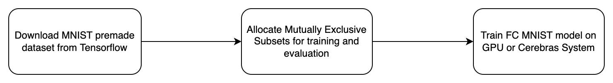

# List of topics

- [Overview of the FC-MNIST model](#overview-of-the-fc-mnist-model)
- [Sequence of the steps to perform](#sequence-of-the-steps-to-perform)
- [Key features from CSoft platform used in this reference implementation](#key-features-from-csoft-platform-used-in-this-reference-implementation)
  - [Multi-Replica data parallel training](#multi-replica-data-parallel-training)
- [Structure of the code](#structure-of-the-code)
- [Dataset and input pipeline](#dataset-and-input-pipeline)
- [How to run:](#how-to-run)
  - [To compile/validate, run train and eval on Cerebras System](#to-compilevalidate-run-train-and-eval-on-cerebras-system)
  - [To run train and eval on GPU/CPU](#to-run-train-and-eval-on-gpucpu)
- [Notes about the frequency of checkpoints at evaluation and train time](#notes-about-the-frequency-of-checkpoints-at-evaluation-and-train-time)
- [Configurations included for this model](#configurations-included-for-this-model)
- [References](#references)

# Overview of the FC-MNIST model

A simple multi-layer perceptron model composed of fully-connected layers
for performing handwriting recognition on the MNIST dataset.
The model is a `3`-layer multi-layer perceptron. The first layer has hidden
size `500`, the second `300`, and the third layer has `num_classes` number of
hidden units (which here is `10`). It then trains on a categorical cross entropy
loss. This structure is based on the survey of different structures on the
MNIST website (ref #3).

# Sequence of the steps to perform
See the following diagram:


# Key features from CSoft platform used in this reference implementation
FC MNIST model configs are supported in the [Layer Pipelined mode](https://docs.cerebras.net/en/latest/cerebras-basics/cerebras-execution-modes.html#layer-pipelined-mode).

## Multi-Replica data parallel training
When training on the Cerebras System, the `--multireplica` flag can be used to perform data-parallel training
across multiple copies of the model at the same time. For more details about this feature, please refer
to [Multi-Replica Data Parallel Training](https://docs.cerebras.net/en/private/general/multi-replica-data-parallel-training.html) documentation page.

# Structure of the code
* `data.py`: Simple data input pipeline loading the dataset from [TFDS](https://www.tensorflow.org/datasets/catalog/mnist).
* `model.py`: Model implementation. 
* `configs/params.yaml`: Example of a YAML configurations file.
* `run.py`: Train script, performs training and validation.
* `utils.py`: Miscellaneous helper functions.

# Dataset and input pipeline

The MNIST dataset comes from a pre-made TF dataset. The train dataset
has a size of `60,000` and the eval dataset `10,000` images.
More information can be found on the
[Tensorflow website](https://www.tensorflow.org/datasets/catalog/mnist).
Each sample in the dataset is a black and white image of size `28x28`, where
each pixel is an integer from `0 to 255` inclusive.

The first time that the input function is run, it will take some time
to download the entire dataset as a set of `10` `tfrecord` files, for a
total of `23`MB.
The default behavior is to download the dataset to `~/tensorflow_datasets`,
although the `data_dir` can be customized (see the [TF documentation](
https://www.tensorflow.org/datasets/api_docs/python/tfds/load)
for more information).

Before running on CPU, `tfds` data should be downloaded using [`prepare_data.py`](prepare_data.py).

The input pipeline does minimal processing on this dataset. The dataset
returns one batch at a time, of the form:
```
inputs = (
    features = Tensor(size=(batch_size, 28*28), dtype=tf.floatX,
    labels = Tensor(size=(batch_size,), dtype=tf.int32,
)
```
Where here, `floatX = float32` if we are running in full precision and
`float16` if we are running in mixed precision mode. You can simply set the mixed precision mode by passing `model.mixed_precision False` as part of the arguments. 

# How to run:
Here we provide how to
    1) Compile and validate
    2) Train and eval on Cerebras System
    3) Train and eval on GPU/CPU
We use [`params.yaml`](configs/params.yaml) as an example, if you want to modify this configuration, or provide your own, please refer to the section [Configurations included for this model](#Configurations-included-for-this-model).

## To compile/validate, run train and eval on Cerebras System

Please follow the instructions on our Developer Docs at:
https://docs.cerebras.net/en/latest/getting-started/cs-tf-quickstart.html

## To run train and eval on GPU/CPU

If running on a cpu or gpu, activate the environment from [Python GPU Environment setup](../../../PYTHON-SETUP.md), and simply run:

```bash
python run.py --mode train --params configs/params.yaml
```

If run outside of the Cerebras environment with `--mode train`, it will skip validation and compilation steps and proceed straight to the training on your allocated hardware.

# Notes about the frequency of checkpoints at evaluation and train time

The current behavior is to switch back and forth between training and
evaluating the model until the global step reaches `max_steps`.
The training will exit every `throttle_secs` seconds and perform
evaluation on the most recent checkpoint saved by the training.
Of note is that this means that if you would like to increase the rate
of evaluation being performed, you may want to save checkpoints more
frequently rather than simply lowering `throttle_secs`.

See the Tensorflow documentation on [TrainSpec](
https://www.tensorflow.org/versions/r1.15/api_docs/python/tf/estimator/TrainSpec)
 and [EvalSpec](
https://www.tensorflow.org/versions/r1.15/api_docs/python/tf/estimator/EvalSpec)
for more information on adjusting the train script to your needs.


# Configurations included for this model
In the [configs](./configs/) directory we have config files to train FC-MNIST model.
    * [params.yaml](./configs/params.yaml) with `hidden_sizes=500, 300`, and `Adam` optimizer.

# References

1. [Original MLP MNIST paper](http://yann.lecun.com/exdb/publis/pdf/lecun-98.pdf)
2. [Tensorflow simple MNIST tutorial](
    https://github.com/tensorflow/tensorflow/blob/master/tensorflow/examples/tutorials/mnist/fully_connected_feed.py)
3. [MNIST website with wide survey of different parameters](
    http://yann.lecun.com/exdb/mnist/)
4. [Tensorflow Datasets MNIST documentation and code](
    https://www.tensorflow.org/datasets/catalog/mnist)
