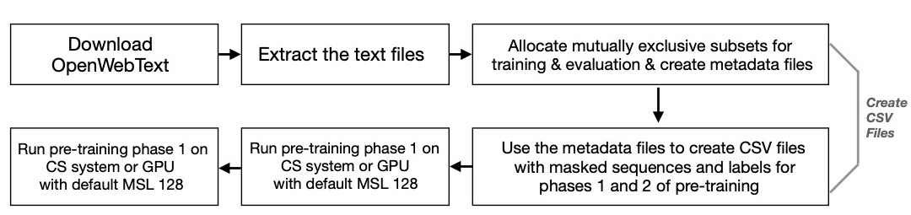

# Bidirectional Transformers for Language Understanding

- [Overview of the model](#overview-of-the-model)
- [Sequence of the steps to perform](#sequence-of-the-steps-to-perform)
- [Key features from CSoft platform used in this reference implementation](#key-features-from-csoft-platform-used-in-this-reference-implementation)
  - [Variable Tensor Shape](#variable-tensor-shape)
  - [Multi-Replica data parallel training](#multi-replica-data-parallel-training)
- [Structure of the code](#structure-of-the-code)
- [Before you start](#before-you-start)
- [Download and prepare the dataset](#download-and-prepare-the-dataset)
  - [Download](#download)
    - [OpenWebText dataset](#openwebtext-dataset)
    - [Other datasets and download links](#other-datasets-and-download-links)
  - [Extract](#extract)
  - [Allocate subsets for training and validation](#allocate-subsets-for-training-and-validation)
  - [Preprocess data](#preprocess-data)
    - [Relevant files](#relevant-files)
    - [Create CSVs for `2`-phase pre-training](#create-csvs-for-2-phase-pre-training)
      - [Phase `1`: MSL `128`](#phase-1-msl-128)
      - [Phase `2`: MSL `512`](#phase-2-msl-512)
- [BERT input function](#bert-input-function)
  - [BERT features dictionary](#bert-features-dictionary)
- [How to run](#how-to-run)
  - [To compile/validate, run train and eval on Cerebras System](#to-compilevalidate-run-train-and-eval-on-cerebras-system)
  - [To run train and eval on GPU/CPU](#to-run-train-and-eval-on-gpucpu)
  - [MLM loss scaling](#mlm-loss-scaling)
  - [Configs included for this model](#configs-included-for-this-model)
- [Appendix](#appendix)

# Overview of the model

Bidirectional Transformers for Language Understanding ([BERT](https://arxiv.org/abs/1810.04805)) is an encoder-only transformer-based model designed for natural language understanding.
This directory contains implementations of the BERT model. It uses a stack of transformer blocks with multi-head attention followed by a multi-layer perceptron feed-forward network.
We support removing next-sentence-prediction (NSP) loss from BERT training processing with only masked-language-modeling (MLM) loss.
The training pipeline has `2` phases. We first train with maximum sequence length of `128` and then train with maximum sequence length of `512`. More details of the model can be found in the [appendix](#appendix).

An overview of the model diagram is here:


We also support the [RoBERTa](https://arxiv.org/abs/1907.11692) model, which is very similar to BERT in terms of architectural design. In order to improve the results on BERT, some changes are made with objective functions (removing NSP), batch sizes, sequence lengths and masking patterns (dynamic vs. static). Difference between dynamic and static masking is discussed [here](#relevant-files).


# Sequence of the steps to perform
This document walks you through an example showing the steps to run a BERT pre-training on the Cerebras Wafer Scale Engine (and on GPUs) using the code in this repo.

> **Note**: You can use any subset of the steps described in this example. For example, if you already downloaded your preferred dataset and created the CSV files, then you can skip the section [Preprocess data](#preprocess-data).

The following block diagram shows a high-level view of the sequence of steps you will perform in this example.



<!-- ## Running BERT on the Cerebras System
 -->

# Key features from CSoft platform used in this reference implementation
In this section, we list CSoft platform specific features which help improve performance for the models listed in this folder.
All of them are running in the pipeline mode, where all layers of the network are loaded altogether into the Cerebras wafer, for more detailed explanation of this mode, refer to [Layer pipelined mode](https://docs.cerebras.net/en/latest/cerebras-basics/cerebras-execution-modes.html#layer-pipelined-mode).

## Variable Tensor Shape
By default, pre-training is configured to use VTS mode when running on the Cerebras System. When running in the VTS mode, the Cerebras System does not perform any computations on the padding tokens. This can potentially result in training speedups. The VTS mode can be disabled by setting `model.enable_vts: False` in the appropriate config file (see [Configs included for this model](#Configs-included-for-this-model) section).
Regardless of the setting of this flag, VTS is not used for running in the eval mode.
In order to take full advantage of the potential speedups from the VTS, it is helpful to batch samples such that every sample in a given batch has a similar length.
Accordingly, for BERT pre-training we bucket samples of similar lengths together before batching. The boundaries between different buckets are defined by `train_input.buckets`.
For more details about VTS, please refer to [PyTorch Variable Tensor Shape
](https://docs.cerebras.net/en/latest/pytorch-docs/pytorch-vts.html) documentation page.

## Multi-Replica data parallel training  
When training on the Cerebras System, the `--multireplica` flag can be used to perform data-parallel training
across multiple copies of the model at the same time. For more details about this feature, please refer to [Multi-Replica Data Parallel Training](https://docs.cerebras.net/en/latest/general/multi-replica-data-parallel-training.html) documentation page.

# Structure of the code
* `configs/`: YAML configuration files.
* `fine_tuning/`: Code for fine-tuning the BERT model.
* `input/`: Input pipeline implementation based on the [Open Web Text dataset](https://skylion007.github.io/OpenWebTextCorpus/). This directory also contains the scripts you can use to download and prepare the Open Web Text dataset. Vocab files are located in `transformers/vocab/`.
* `model.py`: Provides a common wrapper for all models, using the `PyTorchBaseModel` class, which interfaces with  model-specific code. In this repo the model-specific code is in `bert_pretrain_models.py` and `bert_finetune_models.py`. The wrapper provides a common interface for handling the function call of the model with its specific data format. It also provides a common interface to use the same format of configuration files from `configs/` to construct various models.
* `data.py`: The entry point to the data input pipeline code.
* `run.py`: Training script. Performs training and validation.
* `utils.py`: Miscellaneous helper functions.

# Before you start

This example walk-through consists of two main steps:

1. Prepare the dataset.
2. Perform the pre-training.

This example follows the standard practice of `2`-phase pre-training for BERT models. In the `2`-phase pre-training, the model is:

- First pre-trained with the maximum sequence length (MSL) of `128` for `90%` of the steps.
- Then the final `10%` of the steps are pre-trained with the MSL of `512`.

**CSV files for each phase**: You will need to create different CSV files for each of these `2` phases of pre-training, details [here](#preprocess-data).

# Download and prepare the dataset

## Download

### OpenWebText dataset

The scripts for downloading and preprocessing OpenWebText dataset: [https://skylion007.github.io/OpenWebTextCorpus/](https://skylion007.github.io/OpenWebTextCorpus/) are located [here](../../data_processing/scripts/owt/).

Start by downloading the OWT dataset by accessing the following link from a browser:

```url
https://drive.google.com/uc?id=1EA5V0oetDCOke7afsktL_JDQ-ETtNOvx
```

and manually download the `tar.xz` file from that location to your preferred local directory.

> **NOTE**: Currently a server side issue with the OWT site prevents using the below [extract.sh](../../data_processing/scripts/owt/extract.sh) shell script to download this tar file. We will update the script when this issue resolved.

### Other datasets and download links
RoBERTa is trained with OpenWebText and the following datasets in the original [paper](https://arxiv.org/abs/1907.11692):
1. [Book corpus](https://yknzhu.wixsite.com/mbweb)
2. [English Wikipedia](https://en.wikipedia.org/wiki/English_Wikipedia)
3. [CC-News](https://commoncrawl.org/2016/10/news-dataset-available/)
4. [Stories](https://arxiv.org/abs/1806.02847)

> **NOTE**: In order to replicate our results, please use the dataset provided by us. It is a combination of a few of the datasets above but not all. If you want to replicate the results of the original paper, please go to the links and download the required datasets from there.

## Extract

To extract the above-downloaded files, run [extract.sh](../../data_processing/scripts/owt/extract.sh) shell script:

```bash
bash extract.sh
```

> **NOTE**: The [extract.sh](../../data_processing/scripts/owt/extract.sh) may take a while to complete, as it unpacks `40GB` of data (`8,013,770` documents).

Upon completion, the script will produce `openwebtext` folder in the same folder where the tar file is located. The `openwebtext` folder will have multiple subfolders, each containing a collection of `*.txt` files of raw text data (one document per `.txt` file).

> **NOTE**: For other datasets that are used with RoBERTa, you can download the dataset from the links and extract to your preferred location with the corresponding extraction commands.

## Allocate subsets for training and validation

In the next step, you will create two subsets of extracted txt files, one for training and the second for validation. These two subsets are then used to create CSV files that will be used for pre-training.

> **IMPORTANT**: The training and validation subsets must contain mutually exclusive .txt files.

Proceed as follows:

Define metadata files that contain paths to subsets of documents in the `openwebtext` folder to be used for training or validation.

For training, in this tutorial we use a subset of `512,000` documents. The associated metadata file can be found in [metadata/train_512k.txt](../../data_processing/scripts/owt/metadata/train_512k.txt).

For validation, we choose `5,000` documents that are not in the training set. The metadata file for validation can be found in [metadata/val_files.txt](../../data_processing/scripts/owt/metadata/val_files.txt).

>**NOTE**: You are free to create your own metadata files that define your train and validation data subsets, with your preferred content and sizes. You can also create a data subset for the test.

Next, using the metadata file that defines a data subset (for training or for validation), create CSV files containing masked sequences and labels derived from the data subset.

## Preprocess data

The preprocessing comprises of creating CSV files containing sequences and labels.

**Prerequisites**

If you do not have [spaCy](https://spacy.io/), the natural language processing (NLP) library, then install it with the following commands:

```bash
pip install spacy
python -m spacy download en
```

### Relevant files

**`create_csv.py`**

To create CSV files containing sequences and labels derived from the data subset, you will use the Python utility `create_csv.py` located in the [input/scripts](./input/scripts) directory.

**`create_csv_mlm_only.py`**

In addition, [create_csv_mlm_only.py](./input/scripts/create_csv_mlm_only.py) script can be used to create data without the NSP labels.

Note that `create_csv.py` or `create_csv_mlm_only.py` is intended to work with dynamic masking so they do not create masking during preprocessing. Dynamic masking is created on the fly in the `BertCSVDynamicMaskDataProcessor`.

**`create_csv_static_masking.py`**

[create_csv_static_masking.py](./input/scripts/create_csv_static_masking.py) script can be used to create dataset with static masking, which performs masking only once during data preprocessing so on each epoch the same input masks are applied.

**`create_csv_mlm_only_static_masking.py`**

[create_csv_mlm_only_static_masking.py](./input/scripts/create_csv_mlm_only_static_masking.py) script can be used to create static masking without NSP labels.

Note that,

- `create_csv.py` or `create_csv_mlm_only.py` makes csv files to be used with `BertCSVDynamicMaskDataProcessor`.
- `create_csv_static_masking.py` or `create_csv_mlm_only_static_masking.py` makes csv files to be used with `BertCSVDataProcessor.py`.
- `BertCSVDataProcessor.py` loads the masking created during data preprocessing, so on each epoch the same input masks are applied.
- `BertCSVDynamicMaskDataProcessor.py` creates the masking on the fly every time the data is loaded, so the input masks of sentences are different on each epoch.


Refer to [./input/scripts/README.md](./input/scripts/README.md) for more details.

**Syntax**

The command-line syntax to run the Python utility `create_csv.py` is as follows:

```bash
python create_csv.py --metadata_files /path/to/metadata_file.txt --input_files_prefix /path/to/raw/data/openwebtext --vocab_file /path/to/vocab.txt --do_lower_case
```

where:

- `metadata_file.txt` is a metadata file containing a list of paths to documents, and
- `/path/to/vocab.txt` contains a vocabulary file to map WordPieces to word IDs.

For example, you can use the supplied `metadata/train_512k.txt` as an input to generate a training set based on `512,000` documents. Sample vocabularies can be found in the [`transformers/vocab`](../../vocab) folder.

Some arguments and their usage is listed below:

- `--metadata_files`: path to text file containing a list of file names corresponding to the raw input documents to be processed and stored; can handle multiple metadata files separated by space (default: `None`).

- `--input_files_prefix`: prefix to be added to paths of the input files. For example, can be a directory where raw data is stored if the paths are relative.

- `--vocab_file`: path to vocabulary (default: `None`).

- `--split_num`: number of input files to read at a given time for processing (default: `1000`).

- `--do_lower_case`: pass this flag to lower case the input text; should be `True` for uncased models and `False` for cased models (default: `False`).

- `--max_seq_length`: maximum sequence length (default: `128`).

- `--masked_lm_prob`:  masked LM probability (default: `0.15`).

- `--max_predictions_per_seq`: maximum number of masked LM predictions per sequence (default: `20`).

- `--output_dir`: directory where CSV files will be stored (default: `./csvfiles/`).

- `--seed`: random seed (default: `0`).

For more details, run the command: `python create_csv.py --help` (or `python create_csv_static_masking.py --help` if creating statically masked data).

### Create CSVs for `2`-phase pre-training

For the `2`-phase BERT pre-training that we are following in this tutorial, you need to generate the following datasets:

- A training dataset for the first phase using sequences with maximum length of `128`.
- A second training dataset for the second phase using sequences with maximum sequence length of `512`.

If you want to run validation, then:
- Two additional validation datasets, one for each phase.

In total, to run training and validation for both the pre-training phases, you will need four datasets: a training and a validation dataset for phase `1` with MSL `128`, and a training and a validation dataset for phase `2` with MSL `512`.

Proceed as follows to run the following commands:

#### Phase `1`: MSL `128`

**Generate training CSV files**:

```bash
python create_csv.py --metadata_files metadata/train_512k.txt --input_files_prefix /path/to/raw/data/openwebtext --vocab_file ../../../vocab/google_research_uncased_L-12_H-768_A-12.txt --output_dir train_512k_uncased_msl128 --do_lower_case --max_seq_length 128 --max_predictions_per_seq 20
```

**Generate validation CSV files**:

```bash
python create_csv.py --metadata_files metadata/val_files.txt --input_files_prefix /path/to/raw/data/openwebtext --vocab_file ../../../vocab/google_research_uncased_L-12_H-768_A-12.txt --output_dir val_uncased_msl128 --do_lower_case --max_seq_length 128 --max_predictions_per_seq 20
```

#### Phase `2`: MSL `512`

**Generate training CSV files**:

```bash
python create_csv.py --metadata_files metadata/train_512k.txt --input_files_prefix /path/to/raw/data/openwebtext --vocab_file ../../../vocab/google_research_uncased_L-12_H-768_A-12.txt --output_dir train_512k_uncased_msl512 --do_lower_case --max_seq_length 512 --max_predictions_per_seq 80
```

**Generate validation CSV files**:

```bash
python create_csv.py --metadata_files metadata/val_files.txt --input_files_prefix /path/to/raw/data/openwebtext --vocab_file ../../../vocab/google_research_uncased_L-12_H-768_A-12.txt --output_dir val_uncased_msl512 --do_lower_case --max_seq_length 512 --max_predictions_per_seq 80
```

The above-created CSV files are then used by the `BertCSVDynamicMaskDataProcessor` class to produce inputs to the model.

If you want to use static masking instead, generate the csv files with `create_csv_static_masking.py` and specify `BertCSVDataProcessor` as the `data_processor` under train_input in the config file.

# BERT input function

If you want to use your own data loader with this example code, then this section describes the input data format expected by `BertForPreTrainingModel` class defined in [model.py](./model.py).

When you create your own custom BERT input function, you must ensure that your BERT input function produces a features dictionary as described in this section.

## BERT features dictionary

The features dictionary has the following key/values:

- `input_ids`: Input token IDs, padded with `0` to `max_sequence_length`.
  - Shape: [`batch_size`, `max_sequence_length`].
  - Type: `torch.int32`

- `attention_mask`: Mask for padded positions. Has values `0` on the padded positions and `1` elsewhere. Note, this is the opposite of the masking used in the [TensorFlow version](../../tf/bert/) of the model.
  - Shape: [`batch_size`, `max_sequence_length`]
  - Type: `torch.int32`

- `token_type_ids`: Segment IDs. Has values `0` on the positions corresponding to the first segment, and `1` on positions corresponding to the second segment.
  - Shape: [`batch_size`, `max_sequence_length`]
  - Type: `torch.int32`

- `masked_lm_positions`: Positions of masked tokens in the `input_ids` tensor, padded with `0` to `max_predictions_per_seq`.
  - Shape: [`batch_size`, `max_predictions_per_seq`]
  - Type: `torch.int32`

- `masked_lm_weights`: Mask for `masked_lm_positions`. Has values `batch_size / num_masked_tokens_in_batch` on the positions corresponding to actually masked tokens in the given sample, and `0.0` elsewhere. See the [MLM Loss Scaling](#mlm-loss-scaling) section for more detail.
  - Dimensions: [`batch_size`, `max_predictions_per_seq`]
  - Type: `torch.float32`

- `labels`: Labels for computing the masked language modeling loss. Tokens with indices set to ``-100`` are masked.
  - Dimensions: [`batch_size`, `max_sequence_length`]
  - Type: `torch.int32`

- `next_sentence_label`:  Labels for computing the next sequence prediction (classification) loss. Input should be a sequence pair where 0 indicates sequence B is a continuation of sequence A, 1 indicates sequence B is a random sequence.
  - Dimensions: [`batch_size`,]
  - Type: `torch.int32`

> **Note**: You can omit the feature `token_type_ids` and the `next_sentence_label` if you are pre-training for MLM only. (in the yaml file, set `disable_nsp` to True under model params).

# How to run

**Parameter settings in YAML config file**: The config YAML files are located in the [configs](./configs) directory. Before starting a pre-training run, make sure that in the YAML config file you are using:

   - The `train_input.data_dir` parameter points to the correct dataset, and
   - The `train_input.max_sequence_length` parameter corresponds to the sequence length `--max_seq_length` passed in `create_csv.py` or `create_csv_mlm_only.py`.

**Phase-1 with MSL`128` and phase-2 with MSL`512`**: To continue the pre-training with `MSL=512` from a checkpoint that resulted from the first phase of `MSL=128`, the parameter `model.max_position_embeddings` should be set to `512` for both the phases of pre-training.

**Phase-1 with MSL`128`**: If you would like to pre-train a model with `MSL=128` and do not plan to use that model to continue pre-training with a longer sequence length, then you can change this `model.max_position_embeddings` parameter to `128`.

## To compile/validate, run train and eval on Cerebras System

Please follow the instructions on our Developer Docs at:
https://docs.cerebras.net/en/latest/getting-started/pytorch/index.html

## To run train and eval on GPU/CPU

If running on a cpu or gpu, activate the environment from [Python GPU Environment setup](../../../../PYTHON-SETUP.md), and simply run:

```
python run.py --mode train --params /path/to/yaml --model_dir /path/to/model_dir
```

Compared to running on the Cerebras Systems, the only differences are the removal of `--cs_ip` arguments.

> **Note**: Change the command to `--mode eval` for evaluation.

## MLM loss scaling

The MLM Loss is scaled by the number of masked tokens in the current batch. For numerical reasons this scaling is done in two steps:
- First, the `masked_lm_weights` tensor is scaled by `batch_size / num_masked_tokens_in_batch` in the input pipeline, and then
- The final loss is scaled by `1 / batch_size`.

## Configs included for this model
In order to train the model, you need to provide a yaml config file. Below is the list of yaml config files included for this model implementation at [configs](./configs/) folder. Also, feel free to create your own following these examples:
- `bert_base_*.yaml` have the standard bert-base config with `hidden_size=768`, `num_hidden_layers=12`, `num_heads=12`.
- `bert_large_*.yaml` have the standard bert-large config with `hidden_size=1024`, `num_hidden_layers=24`, `num_heads=16`.
- Files with substrings `MSL***` like `bert_base_MSL128.yaml` contain different maximum sequence length. Popular sequence lengths are `128`, `512`, `1024` provided in our example config files.
- Files like `bert_*_vts.yaml` with `_vts` substring in their names enable variable tensor shape (VTS) training, which is a unique feature provided on Cerebras hardware to improve model performance. You can find details about the VTS implementation [here](#variable-tensor-shape).
- Files like `roberta_*.yaml` are provided to run RoBERTa model variants [RoBERTa: A Robustly Optimized BERT Pretraining Approach](https://arxiv.org/abs/1907.11692).

All configs are meant to be run on Pipeline mode using Appliance mode and Kubernetes flow. Slurm workflow is available as a legacy support.

# Appendix

**Reference**: BERT paper on arXiv.org: [BERT: Pre-training of Deep Bidirectional Transformers for Language Understanding](https://arxiv.org/abs/1810.04805).

**Reference**: RoBERTa paper on arXiv.org: [RoBERTa: A Robustly Optimized BERT Pretraining Approach](https://arxiv.org/abs/1907.11692).