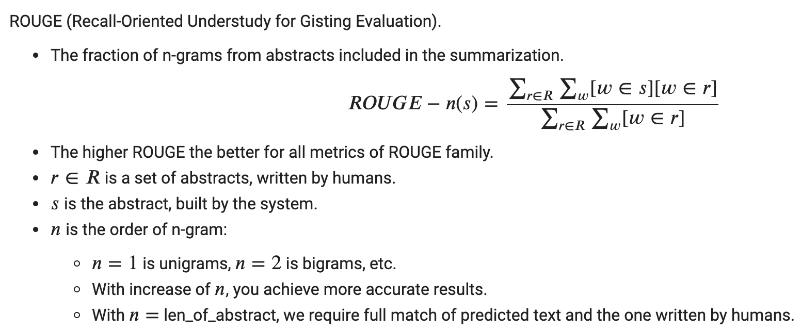

# Summarization task

- [Model overview](#model-overview)
  - [Rouge metric](#Rouge-metric)
- [Sequence of steps to perform](#sequence-of-steps-to-perform)
- [Key features from Cerebras](#key-features-from-cerebras)
- [Structure of the code](#structure-of-the-code)
- [Download and prepare the dataset](#download-and-prepare-the-dataset)
	- [BERT Summarization input](#BERT-Summarization-Input)
		- [BERT Summarization features dictionary](#BERT-Summarization-features-dictionary)
      - [Prepare input format](#Prepare-input-format) 
- [Input function pipeline](#input-function-pipeline)
- [Compile model](#compile-model)
  - [Validate only](#validate-only)
  - [Compile only](#compile-only)
- [Run fine-tuning](#run-fine-tuning)
	- [Run fine-tuning on Cerebras System](#run-fine-tuning-on-the-cerebras-system)
	- [Run fine-tuning on GPU](#run-fine-tuning-on-gpu)
- [Configs included for this model](#configs-included-for-this-model)
- [References](#references)

## Model overview <a name="model-overview"></a>

A summarizaion task is the task of automatically generating a shorter version of the 
document while retaining its most important information.

Usually the task is divided into two paradigms: abstractive summarization and extractive summarization.

In abstractive summarization, target summaries contain words
or phrases that were not in the original text, and usually require various text rewriting.

This code implements the extractive summarization approach,
where the summary is formed by copying and concatenating the most important
spans (usually sentences) in the document. 

### Rouge metric 
Rouge metric [wiki](https://en.wikipedia.org/wiki/ROUGE_\(metric\)) is a special
metric for asessing summarization tasks. It takes `1-grams`, `2-grams`, etc. and evaluates
the percentage of intersection between the referenced `n-grams` and the `n-grams` predicted by the system.
This percentage can be later on evaluated in terms of `f1-score`, `precition` and `recall`. 




## Sequence of steps to perform

The following block diagram shows a high-level view of the sequence of steps you will perform in this example.

<p align = "center">

</p>
<p align = "center">
Fig.1 - Flow Chart of steps to fine-tune BERT summarization model
</p>


## Key features from Cerebras
BERT for extractive summarization is pipeline mode enabled, in this mode, during the runtime all the layers of the network are loaded altogether onto the Cerebras WSE. Training data is streamed into the WSE continuously. Weights are updated on the WSE and remain in the memory on the WSE within the layer to which they belong. For more details, see [[3]](https://docs.cerebras.net/en/latest/cerebras-basics/cerebras-execution-modes.html#layer-pipelined-mode).


## Structure of the code

* `configs/`: YAML configuration files.
* `input/`: Input pipeline implementation based on the [DeepMind Q&A Dataset](https://cs.nyu.edu/~kcho/DMQA/).
* `model.py`: Model implementation leveraging [BertSummarization](../../bert_model.py) class.
* `data.py`: The entry point to the data input pipeline code.
* `run.py`: Training script. Performs training and validation.
* `utils.py`: Miscellaneous helper functions.


## Download and prepare the dataset

For information about how to download and prepare the dataset
refer to [input/README.md](input/README.md).

### BERT Summarization input

#### BERT Summarization features dictionary

The features dictionary has the following key-value pairs (shown in [input/BertSumCSVDataProcessor.py](input/BertSumCSVDataProcessor.py)):

`input_ids`: Input token IDs, padded with `0`s to `max_sequence_length`.

- Shape: `[batch_size, max_sequence_length]`.
- Type: `torch.int32`.

`attention_mask`: Mask for padded positions. Has `0`s on the padded positions
and `1`s elsewhere.

- Shape: `[batch_size, max_sequence_length]`.
- Type: `torch.int32`.

`token_type_ids`: Segment IDs. A segment is equal to `0` or `1`
 conditioned on index of the sentence is odd or even. For example, for `[sent1, sent2, sent3, sent4, sent5]` we will assign `[0, 1, 0, 1, 0]`.

`label_ids`: The label tensor. Carries the labels for each sentence. It's binary labels that indicate if each sub-sentences should be included in the summary. Please note that `max_cls_tokens` indicates the number of sub-sentences in our input text.

- Shape: `[batch_size, max_cls_tokens]`.
- Type: `torch.int32`.

`cls_indices`: CLS indices. Specifies indices in the `[CLS]` tokens in the `input_ids`.

- Shape: `[batch_size, max_cls_tokens]`.
- Type: `torch.int32`.

`cls_weights`: CLS tokens weights. Equal to `1` for all real `[CLS]` tokens, and `0` for all padded.

- Shape: `[batch_size, max_cls_tokens]`.
- Type: `torch.float32`.


A demo example of the input string and segment ID structure for single extractive_summarization:

``` bash
Tokens:   [CLS] sent one [SEP][CLS] sent two [SEP][CLS] sent three [SEP][CLS] sent four [SEP][PAD] [PAD] ...
Segments:   0    0    0    0    1    1    1    1   0     0     0     0    1    1    1    1     0    0    ...
label       0                   1                  0                      0
```
NOTE: The input tokens will be converted to IDs using the vocab file.

___

#### Prepare input format
To use BERT for extractive summarization, we follow the approach provided in the 
paper [Fine-tune BERT for Extractive Summarization by Yang Liu](https://arxiv.org/pdf/1903.10318.pdf).

In order to apply BERT, authors suggest to fine-tune pre-trained BERT weights
by formatting the input into the special format: 


Each sentence starts with a special `[CLS]` token. The context representation of this token will be used to make
a decision if this sentence will be present in the predicted summary or not.

Each sentence is split with `[SEP]` tokens. Interval segments are also formatted in a special
way to help distinguish multiple sentences within one document: we alternate segment embeddings
between `E_A` and `E_B` for each subsequent sentence.
For example, for `[sent_1, sent_2, sent_3, sent_4, sent_5]` we will assign
`[E_A, E_B, E_A, E_B, E_A]`.


## Input function pipeline
For more details about the input function pipeline used for the models located in this folder, please refer to a separate documentation [input/README.md](input/README.md).

## Compile model

We recommend that you first compile your model successfully on a support cluster CPU node before running it on the CS system.

### Validate only

You can run in `validate_only` mode that runs a fast, light-weight verification. In this mode, the compilation will only run through the first few stages, up until kernel library matching. You can run it by using the below command:

```bash
csrun_cpu python-pt run.py \
  --mode=train \
  --params <path/to/yaml> \
  --model_dir </path/to/model_dir> \
  --validate_only 
```

After a successful `validate_only` run, you can run full compilation with `compile_only` mode.

### Compile only

This step runs the full compilation through all stages of the Cerebras software stack to generate a CS system executable. You can run it by using the below command:

```bash
csrun_cpu python-pt run.py \
  --mode=train \
  --params <path/to/yaml> \
  --model_dir </path/to/model_dir> \
  --compile_only 
```

When the above compilation is successful, the model is guaranteed to run on CS system. You can also use this mode to run pre-compilations of many different model configurations offline, so that you can fully utilize allocated CS system cluster time.


## Run fine-tuning

**IMPORTANT**: See the following notes before proceeding further.

After obtaining the sentence vectors from BERT, following `Yang Liu`, we build several
summarization-specific layers stacked on top of the BERT outputs, to capture
document-level features for extracting summaries (See image below). For each sentence sent<sub>i</sub>,
we will calculate the final predicted score P<sub>i</sub> . The loss of the whole
model is the Binary Classification Entropy of P<sub>i</sub> against gold label Y<sub>i</sub>.
These summarization layers are jointly fine-tuned with BERT.


**Parameter settings in YAML config file**: The config YAML files are located in the [configs](configs/) directory. Before starting a fine-tuning run, make sure that in the YAML config file you are using:

- The `train_input.data_dir` parameter points to the correct dataset, and
- The `train_input.max_sequence_length` parameter corresponds to the sequence length of the dataset.
- The `train_input.batch_size` parameter will set the batch size for the training.

Same applies for the `eval_input`.

### Run fine-tuning on Cerebras System<a name="run-fine-tuning-on-the-cerebras-system"></a>

Follow [How to train on the CS System](../../../#how-to-train-on-the-cs-system) and execute the following command from within the Cerebras environment:

```bash
csrun_wse python-pt run.py \
--mode train \
--cs_ip x.x.x.x \
--params /path/to/yaml \
--model_dir /path/to/model_dir \
--checkpoint_path /path/to/pretrained_checkpoint.mdl
--is_pretrained_checkpoint
```

where:

- `/path/to/yaml` is a path to the YAML config file with model parameters. A few example YAML config files can be found in [configs](#configs-included-for-this-model) directory.
- `/path/to/model_dir` is a path to the directory where you would like to store the logs and other artifacts of the run.
- `cs_ip` is the IP address of the CM endpoint.
- `checkpoint_path` is the path to the saved checkpoint from BERT fine-tuning.
- `is_pretrained_checkpoint` flag is needed for loading the pre-trained BERT model for fine-tuning.

### Run fine-tuning on GPU

To run fine-tuning on GPU, use the `run.py` Python utility as follows:

```bash
python run.py \
--mode train \
--params /path/to/yaml \
--model_dir /path/to/model_dir \
--checkpoint_path /path/to/pretrained_checkpoint.mdl
--is_pretrained_checkpoint
```

where `--is_pretrained_checkpoint` should be provided for loading the pretrained BERT model for finetuning. `--is_pretrained_checkpoint` and `--checkpoint_path` can be left out if training from scratch.
The description of other command-line arguments is the same as in the above section.

For more information about how to start training task on GPU/CPU or the Cerebras System,
refer to [fine-tuning README.md](./../README.md).

## Configs included for this model

In order to train the model, you need to provide a yaml config file. Below is the list of yaml config files included for this model implementation at [configs](./configs/) folder. Also, feel free to create your own following these examples:

- `bert_base_summarization.yaml` have the standard bert-base config with `hidden_size=768, num_hidden_layers=12, num_heads=12` as a backbone.
- `bert_large_summarization.yaml` have the standard bert-large config with `hidden_size=1024, num_hidden_layers=24, num_heads=16` as a backbone.

## References

[1] [BERT paper](https://arxiv.org/abs/1810.04805)

[2] [Fine-tune BERT for Extractive Summarization](https://arxiv.org/abs/1903.10318)

[3] [Pipeline Execution Mode](https://docs.cerebras.net/en/latest/cerebras-basics/cerebras-execution-modes.html#layer-pipelined-mode)

