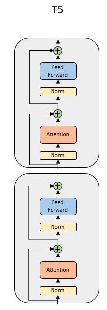

# T5 Language Models

- [T5 Language Models](#t5-language-models)
  - [Model overview](#model-overview)
  - [Sequence of the steps to perform](#sequence-of-the-steps-to-perform)
  - [Key features from CSoft platform](#key-features-from-csoft-platform)
  - [Code structure](#code-structure)
  - [Data processing](#data-processing)
    - [Colossal Clean Crawled Corpus dataset](#colossal-clean-crawled-corpus-dataset)
    - [C4 processing commands](#c4-processing-commands)
  - [Input function pipeline](#input-function-pipeline)
  - [Running model commands](#running-model-commands)
  - [To compile/validate, run train and eval on Cerebras System](#to-compilevalidate-run-train-and-eval-on-cerebras-system)
  - [To run train and eval on GPU/CPU](#to-run-train-and-eval-on-gpucpu)
  - [Implementation notes](#implementation-notes)
  - [Configs included for this model](#configs-included-for-this-model)
  - [Citations](#citations)

## Model overview

This directory contains implementations for the T5 Model, specifically, a version of the T5 model introduced in [\[2\]](https://arxiv.org/abs/1910.10683), which was trained in a self-supervised manner on the C4 [dataset](https://www.tensorflow.org/datasets/catalog/c4).
An earlier version of T5 also included supervised datasets during pre-training, but we follow the improvements in T5.1.1 [\[3\]](https://github.com/google-research/text-to-text-transfer-transformer/blob/main/released_checkpoints.md#t511) that include training only on C4.
T5 includes some changes to the block, including the location of the normalization layer and the residual connections, also illustrated in the figure below.

We refer to sections of the T5 paper for further details, but the primary contributions from T5 come from studying different variations of transformer architectures such as encoder-decoder vs decoder-only (Section 3.2), and optimization objectives such as language-modeling vs denoising (Section 3.3). 
They also introduce the "text-to-text" formulation that allows any arbitrary NLP task to be converted into the same format. This allows their model to be directly applied to any task (Section 2.4).

<p align="center">
    
</p>
<p align="center">
    T5 block
</p>

## Sequence of the steps to perform

The high-level steps for training a model are relatively simple, involving data-processing and tokenization, and then model training.

* Data-processing and tokenization
    * Elaborated in the [Data Processing Commands](#data-processing) section.
* Training the model on CS system or GPU using `run.py`
    * Elaborated in the [Running Model Commands](#running-model-commands) section.

The steps to perform are listed in the diagram below. Bold files are scripts to be run, with explanations of the steps in parenthesis underneath. 
<p align="center">
    
</p>
<p align="center">
    Flow-charts for the training procedure for the T5 models. Files in bold are scripts to be run, along with short explanations of the steps involved. 
</p>

## Key features from CSoft platform

* T5 models support [Variable Tensor Shape (VTS)](https://docs.cerebras.net/en/latest/pytorch-docs/pytorch-vts.html) configurations.  At a high-level, this means that we can take advantage of Cerebras hardware's differences from GPU's to perform operations on different sized sequences in parallel, without requiring padding tokens. This reduces the amount of time spent on computations that are never used in the end. For more details, see [\[4\]](https://www.cerebras.net/software/increasing-model-throughput-with-variable-tensor-shape-computations/) and [\[5\]](https://docs.cerebras.net/en/latest/pytorch-docs/pytorch-vts.html).
To run either model with VTS, simply add `enable_vts: True` to the `model` section of the configuration YAML file for a training run.  
* T5 currently support pipeline execution mode, in which the entire model is loaded onto the Wafer-Scale Engine (WSE) and data streams across the layers. See [\[6\]](https://docs.cerebras.net/en/latest/cerebras-basics/cerebras-execution-modes.html#layer-pipelined-mode) for further details. 

## Code structure

In this section we describe the structure of the code for the Cerebras model and data implementations.

The following few scripts are relatively generic and shared between models. They provide an entry-point from the model-specific code to interface with shared training/validation code.

* `run.py`: A generic training script that connects all models and dataloaders to the training pipeline. Not much is contained in this script; it imports the correct model and dataloader from `model.py` and `data.py` respectively.
* `data.py`: A generic script that wraps code in a format to work with `run.py`. The real work for data-processing is done in the `input/` directory, which creates classes that are imported in `data.py`.  
* `model.py`: Provides a common wrapper for all models, using the `PyTorchBaseModel` class, which interfaces with  model-specific code. In this repo the model-specific code is in `t5_model.py`. The wrapper provides a common interface for handling the function call of the model with its specific data format. It also provides a common interface to use the same format of configuration files from `configs/` to construct various models.
* `utils.py`: Miscellaneous functions that are used to interface with the YAML files.

The following directories contain the specific implementation details for the current model.

* `configs/`: A directory of YAML files that specifies all the details about a training run. Each config YAML is split into five sections that determine the training run: `train_input`, `eval_input`, `model`, `optimizer`, and `runconfig`. The first two sections specify the data-processor class and its various arguments, such as batch-size, file-paths to data, etc. The `model` section specifies arguments such as hidden-sizes, number of layers, dropout rates, etc. The `optimizer` section specifies which algorithm to use, such as Adam [\[7\]](https://arxiv.org/abs/1412.6980), AdamW [\[8\]](https://arxiv.org/abs/1711.05101), or Adafactor [\[9\]](https://arxiv.org/abs/1804.04235). It also specifies arguments such as decay rates. Finally the `runconfig` section specifies how many steps you want to train for, the interval for saving models, interval for logging loss values in tensorboard, etc.
* `input/`: A directory for scripts relating to data-processing. The `T5DynamicDataProcessor.py` and `TransformerDynamicDataProcessor.py` scripts create the [PyTorch DataLoader](https://pytorch.org/tutorials/beginner/basics/data_tutorial.html) that is used during training and validation. It uses functions from `input/utils.py` for a lot of the functionality. 

## Data processing

### Colossal Clean Crawled Corpus dataset

The Colossal Clean Crawled Corpus (C4) Dataset is a publicly-available dataset hosted [here](https://www.tensorflow.org/datasets/catalog/c4), and is based on cleaning ~7 TB of data from [Common Crawl](https://commoncrawl.org/). See Section 2.2 of [\[2\]](https://arxiv.org/abs/1910.10683) for further details.
The following commands handle formatting of this dataset for you, but if you decide to change the dataset or dataloaders, make 
sure you follow the same input function pipeline as described in [Input function pipeline](#input-function-pipeline).

### C4 processing commands

Download the pre-trained tokenizer model from [HuggingFace](https://huggingface.co/google/t5-11b-ssm-nq/blob/main/spiece.model). Place it in the `./input/` directory.

Move to the `./input/` directory, and simply run [preprocess_c4.sh](./input/preprocess_c4.sh) script:

```bash
bash preprocess_c4.sh
```

By running it, you will download C4 from HuggingFace and tokenize it using the [sentencepiece](https://github.com/google/sentencepiece) tokenizer. The tokens for Tensorflow and PyTorch models are the same, so this only needs to be run once.  

Note: it saves the data to `./c4` directory, but this can be changed easily by adjusting the first line in the `preprocess.sh` script that specifies `dataset_root`. Since the dataset is extremely large, it takes ~56 hours on a 4 cpu core machine. However, it can easily be parallelized across multiple nodes to speed up the process if you have a distributed compute cluster.

## Input function pipeline

For details about the input function pipeline used for the models located in this folder, please refer to a separate documentation [input/README.md](input/README.md).

## Running model commands

## To compile/validate, run train and eval on Cerebras System

Please follow the instructions on our Developer Docs at:
https://docs.cerebras.net/en/latest/getting-started/pytorch/index.html

## To run train and eval on GPU/CPU

If running on a cpu or gpu, activate the environment from [Python GPU Environment setup](../../../../PYTHON-SETUP.md), and simply run:

```
python run.py --mode train --params path/to/yaml --model_dir /path/to/model_dir
```

For each of these commands,

* `path/to/yaml` is a path to the YAML configuration file containing the model parameters. Parameters for the base configuration of the model are provided in the section [Configs included for this model](#Configs-included-for-this-model).
* `path/to/model_dir` is the path to the model directory where compile and training artifacts will be saved.

## Implementation notes

There are a couple modifications to both models based on current support for operations on CS systems. Resolving these is currently in progress:

1. We do not currently support the Adafactor optimizer used to train the original T5 model. Instead we use AdamW, which results in a higher loss at the end of pre-training.
2. For T5, we do not currently support `RMSNorm` [\[10\]](https://arxiv.org/abs/1910.07467). Instead, we use `LayerNorm` [\[11\]](https://arxiv.org/abs/1607.06450v1) as our normalization layer. 

## Configs included for this model 

In the [configs](./configs/) directory we have files for T5. 

* [T5-small](configs/t5_small.yaml) have a small reference with `d_kv=64`, `num_heads=6`, `encoder_num_hidden_layers=8`.
* [T5-base](configs/t5_base.yaml) have a base reference with `d_kv=64`, `num_heads=12`, `encoder_num_hidden_layers=12`.

All configs are meant to be run on Pipeline mode using Appliance mode and Kubernetes flow. Slurm workflow is available as a legacy support.

These files are just samples, and can be adjusted for any changes in training procedure that you desire, such as different number of layers or hidden sizes, or different number of steps.  

**NOTE:** When trying out a new dataset by switching it in the provided configs, if you run into errors, we advise to disable VTS as a first step of debugging. 

## Citations

[1] [Attention Is All You Need](https://arxiv.org/abs/1706.03762) 

[2] [Exploring the Limits of Transfer Learning with a Unified Text-to-text Transformer](https://arxiv.org/abs/1910.10683).

[3] [T5v1.1](https://github.com/google-research/text-to-text-transfer-transformer/blob/main/released_checkpoints.md#t511).

[4] [VTS Conceptual Explanation Blog](https://www.cerebras.net/software/increasing-model-throughput-with-variable-tensor-shape-computations/)

[5] [VTS Software Documentation](https://docs.cerebras.net/en/latest/pytorch-docs/pytorch-vts.html)

[6] [Pipeline Execution Mode](https://docs.cerebras.net/en/latest/cerebras-basics/cerebras-execution-modes.html#layer-pipelined-mode)

[7] [Adam](https://arxiv.org/abs/1412.6980)

[8] [AdamW](https://arxiv.org/abs/1711.05101)

[9] [Adafactor](https://arxiv.org/abs/1804.04235)

[10] [RMSNorm](https://arxiv.org/abs/1910.07467)

[11] [LayerNorm](https://arxiv.org/abs/1607.06450v1)

[12] [An Empirical Study of Pre-Trained Language Model Positional Encoding](https://arxiv.org/pdf/2010.04903.pdf)
