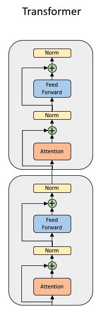

# Transformer Language Models

- [Transformer Language Models](#transformer-language-models)
  - [Model overview](#model-overview)
  - [Sequence of the steps to perform](#sequence-of-the-steps-to-perform)
  - [Key features from CSoft platform](#key-features-from-csoft-platform)
  - [Code structure](#code-structure)
  - [Data processing](#data-processing)
  - [English to German Translation dataset](#english-to-german-translation-dataset)
    - [WMT-16 processing commands](#wmt-16-processing-commands)
  - [Input function pipeline](#input-function-pipeline)
  - [Running model commands](#running-model-commands)
    - [Steps to compile and validate](#steps-to-compile-and-validate)
  - [To run train and eval on Cerebras System](#to-run-train-and-eval-on-cerebras-system)
  - [To run train and eval on GPU/CPU](#to-run-train-and-eval-on-gpucpu)
  - [Implementation notes](#implementation-notes)
  - [Configs included for this model](#configs-included-for-this-model)
  - [Citations](#citations)

## Model overview

This directory contains implementations for the Transformer Model. There is a lot of overlap between this model and [T5](../t5/) model architecture, so we take advantage of commonalities to avoid redundancy in our implementation. There are a number of differences, however, including architecture decisions, model sizes, datasets, and training objectives.

The Transformer model introduced in [1], which was trained on the WMT English-German translation dataset. It was a ground-breaking model, opening the current wave of transformer architectures that dominate NLP. It is based on a block composed of a multi-head self-attention layer, normalization layer, feed-forward layer, and another normalization layer, with residual connections. We show a diagram below to illustrate the exact structure of the block.

The original Transformer paper did not try to generalize across as many tasks, looking at only one task besides translation.

<p align="center">
    
</p>
<p align="center">
    Transformer block
</p>

## Sequence of the steps to perform

The high-level steps for training a model are relatively simple, involving data-processing and tokenization, and then model training.

* Data-processing and tokenization
    * Elaborated in the [Data Processing Commands](#data-processing) section.
    * There are separate sections for T5 and Transformer because they use different datasets.
* Training the model on CS system or GPU using `run.py`
    * Elaborated in the [Running Model Commands](#running-model-commands) section.

The steps to perform are listed in the diagram below. Bold files are scripts to be run, with explanations of the steps in parenthesis underneath. 
<p align="center">
    
</p>
<p align="center">
    Flow-charts for the training procedure for the Transformer models. Files in bold are scripts to be run, along with short explanations of the steps involved.
</p>

## Key features from CSoft platform

* Transformer models support [Variable Tensor Shape (VTS)](https://docs.cerebras.net/en/latest/pytorch-docs/pytorch-vts.html) configurations.  At a high-level, this means that we can take advantage of Cerebras hardware's differences from GPU's to perform operations on different sized sequences in parallel, without requiring padding tokens. This reduces the amount of time spent on computations that are never used in the end. For more details, see [\[4\]](https://www.cerebras.net/software/increasing-model-throughput-with-variable-tensor-shape-computations/) and [\[5\]](https://docs.cerebras.net/en/latest/pytorch-docs/pytorch-vts.html).
To run either model with VTS, simply add `enable_vts: True` to the `model` section of the configuration YAML file for a training run.  
* Transformer supports `--multireplica` flag can be used to perform data-parallel training across multiple copies of the model at the same time. To read more, please refer to [Multi-Replica Data Parallel Training](https://docs.cerebras.net/en/latest/general/multi-replica-data-parallel-training.html) documentation page.

## Code structure

In this section we describe the structure of the code for the Cerebras model and data implementations.

The following few scripts are relatively generic and shared between models. They provide an entry-point from the model-specific code to interface with shared training/validation code.

* `run.py`: A generic training script that connects all models and dataloaders to the training pipeline. Not much is contained in this script; it imports the correct model and dataloader from `model.py` and `data.py` respectively.

The following directories contain the specific implementation details for the current model.

* `configs/`: A directory of YAML files that specifies all the details about a training run. Each config YAML is split into five sections that determine the training run: `train_input`, `eval_input`, `model`, `optimizer`, and `runconfig`. The first two sections specify the data-processor class and its various arguments, such as batch-size, file-paths to data, etc. The `model` section specifies arguments such as hidden-sizes, number of layers, dropout rates, etc. The `optimizer` section specifies which algorithm to use, such as Adam [\[7\]](https://arxiv.org/abs/1412.6980), AdamW [\[8\]](https://arxiv.org/abs/1711.05101), or Adafactor [\[9\]](https://arxiv.org/abs/1804.04235). It also specifies arguments such as decay rates. Finally the `runconfig` section specifies how many steps you want to train for, the interval for saving models, interval for logging loss values in tensorboard, etc.
* `input/`: A directory for scripts relating to data-processing.

## Data processing

## English to German Translation dataset

The Workshop on Statistical Machine Translation - 2016 (WMT-16) English to German Translation dataset is a publicly-available translation dataset hosted by the [ACL 2016 Conference on Machine Translation](https://www.statmt.org/wmt16/translation-task.html). It contains data from news commentary in different languages, and European parliamentary proceedings.
The following commands handle formatting of this dataset for you, but if you decide to change the dataset or dataloaders, make sure you follow the same input function pipeline as described in [Input function pipeline](#input-function-pipeline).

### WMT-16 processing commands

Please use the script [wmt16_en_de.sh](./input/data_processing/wmt16_en_de.sh) to download, preprocess and tokenize the dataset.

From the `transformer/` directory, run the commands:
```bash
cd input/data_processing
bash wmt16_en_de.sh
```

The steps in the above script can be summarized as below:

1. Download data from [wmt16 webpage](https://www.statmt.org/wmt16/translation-task.html). This consists of europarl-v7, commoncrawl and news-commentary corpora.
2. Concatenate these to form the training dataset
3. Concatenate newstest2015 and newstest2016 to create validation dataset
4. Process raw files using [Mosesdecoder](https://github.com/moses-smt/mosesdecoder)
5. Create shared byte-pair encoding vocabulary using `32000` merge operations
6. Add special tokens to the beginning of the vocab files

After the dataset is generated, please run the next two commands to split up the input dataset into multiple files, and generate `meta.dat` file. 
The meta file will be generated inside the source directory. 
We split the data into many files so that multiple worker nodes can read the files in parallel. 
We want the speed of passing data to the CS system to keep up with the speed of the compute of the CS system, which requires multiple workers handling data.
The `--buffer_len` argument describes how many examples will be in each output file. It defaults to `17581`, which gives us `256` output files for this dataset. If you change datasets, please consider updating these settings. 
```bash
python split_files.py --src_file <path-to-source-data-in-one-file> --tgt_file {path-to-target-translated-data-in-one-file}
--src_dir <path-to-source-directory> --tgt_dir {path-to-target-translated-directory}
--buffer_len <number-of-examples-to-store-in-one-output-file>
```

```bash
python create_meta.py --src_dir <path-to-source-directory> --tgt_dir {path-to-target-translated-directory}
```

Now `--src_dir` and `--tgt_dir` contains examples that can be used for model training.

## Input function pipeline

For details about the input function pipeline used for the models located in this folder, please refer to a separate documentation [here](../t5/input/README.md).

## Running model commands

## To compile/validate, run train and eval on Cerebras System

Please follow the instructions on our Developer Docs at:
https://docs.cerebras.net/en/latest/getting-started/pytorch/index.html

## To run train and eval on GPU/CPU

If running on a cpu or gpu, activate the environment from [Python GPU Environment setup](../../../../PYTHON-SETUP.md), and simply run:

```
python run.py --mode train --params path/to/yaml --model_dir /path/to/model_dir
```

For each of these commands,

* `path/to/yaml` is a path to the YAML configuration file containing the model parameters. Parameters for the base configuration of the model are provided in the section [Configs included for this model](#configs-included-for-this-model).
* `path/to/model_dir` is the path to the model directory where compile and training artifacts will be saved.

## Implementation notes

There are a couple modifications to both models based on current support for operations on CS systems. Resolving these is currently in progress:

1. We do not currently support the Adafactor optimizer used to train the original Transformer model. Instead we use AdamW, which results in a higher loss at the end of pre-training.
2. For Transformer, we use learned absolute position embeddings instead of fixed position embeddings, which slightly degrades the performance of the model. For explanation and analysis of the different position embeddings, see [\[12\]](https://arxiv.org/pdf/2010.04903.pdf).

## Configs included for this model

In the [configs](./configs/) directory we have files for Transformer. 

* [Transformer-base](configs/transformer_base.yaml) have a base reference with `d_kv=64`, `num_heads=8`, `encoder_num_hidden_layers=6`.
* [Transformer-large](configs/transformer_large.yaml) have a large reference with `d_kv=64`, `num_heads=16`, `encoder_num_hidden_layers=6`.

All configs are meant to be run on Pipeline mode using Appliance mode and Kubernetes flow. Slurm workflow is available as a legacy support.

These files are just samples, and can be adjusted for any changes in training procedure that you desire, such as different number of layers or hidden sizes, or different number of steps.

## Citations

[1] [Attention Is All You Need](https://arxiv.org/abs/1706.03762) 

[2] [Exploring the Limits of Transfer Learning with a Unified Text-to-text Transformer](https://arxiv.org/abs/1910.10683).

[3] [T5v1.1](https://github.com/google-research/text-to-text-transfer-transformer/blob/main/released_checkpoints.md#t511).

[4] [VTS Conceptual Explanation Blog](https://www.cerebras.net/software/increasing-model-throughput-with-variable-tensor-shape-computations/)

[5] [VTS Software Documentation](https://docs.cerebras.net/en/latest/pytorch-docs/pytorch-vts.html)

[6] [Pipeline Execution Mode](https://docs.cerebras.net/en/latest/cerebras-basics/cerebras-execution-modes.html#layer-pipelined-mode)

[7] [Adam](https://arxiv.org/abs/1412.6980)

[8] [AdamW](https://arxiv.org/abs/1711.05101)

[9] [Adafactor](https://arxiv.org/abs/1804.04235)

[10] [RMSNorm](https://arxiv.org/abs/1910.07467)

[11] [LayerNorm](https://arxiv.org/abs/1607.06450v1)

[12] [An Empirical Study of Pre-Trained Language Model Positional Encoding](https://arxiv.org/pdf/2010.04903.pdf)
