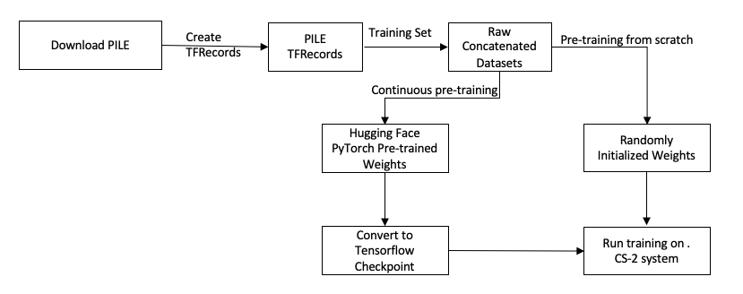

# Running GPT-J (Neox)

- [Running GPT-J (Neox)](#running-gpt-j)
  - [Introduction](#introduction)
  - [Sequence of the steps to perform](#sequence-of-the-steps-to-perform)
  - [Key features used from CSoft platform](#key-features-used-from-csoft-platform)
  - [Structure of the code](#structure-of-the-code)
  - [Prepare the Pile dataset](#prepare-the-pile-dataset)
  - [Input function](#input-function)
  - [Run training](#run-training)
  - [To compile/validate, run train and eval on Cerebras System](#to-compilevalidate-run-train-and-eval-on-cerebras-system)
  - [To run train and eval on GPU/CPU](#to-run-train-and-eval-on-gpucpu)
  - [Configuration files included for this model](#configuration-files-included-for-this-model)
  - [Citations](#citations)
 
## Introduction

GPT-J [[1]](https://github.com/kingoflolz/mesh-transformer-jax) is an auto-regressive language model created by [EleutherAI](https://www.eleuther.ai/). A canonical configuration of the model, 
GPT-J-6B [[1]](https://github.com/kingoflolz/mesh-transformer-jax) ([param_file](configs/params_gptj.yaml)), has `6B` parameters and it is has been trained by EleutherAI on a dataset called [Pile](https://arxiv.org/abs/2101.00027). Pile is
carefully assembled and curated from a large number of text datasets from different domains. 
GPT-J-6B has been demonstrated to perform reasonably well on a number of natural language tasks "as-is", 
without any further training, in a zero-shot setting. With our implementation of GPT-J [[1]](https://github.com/kingoflolz/mesh-transformer-jax)
it is now easy to pre-train a GPT-J [[1]](https://github.com/kingoflolz/mesh-transformer-jax) model and fine-tune this model on a single CS system
with a custom domain-specific or task-specific dataset.
      
The design of the GPT-J [[1]](https://github.com/kingoflolz/mesh-transformer-jax) model is similar to GPT-3 [[4]](https://arxiv.org/abs/2005.14165) with a few notable differences:
* GPT-J [[1]](https://github.com/kingoflolz/mesh-transformer-jax) introduces a parallel decoder architecture, where attention and feed-forward layers in decoder are 
computed in parallel and then the results are added, as opposed to computing them  sequentially 
by feeding the attention output into the feed-forward layer, as in the standard transformer models (see the diagram with GPT and GPT-J architecture comparison below). This architectural 
change has been introduced by EleutherAI to achieve higher throughput with distributed training and it allows us to run the model on a single CS system without any model parallelism.
With the traditional design, residual attention with op-sharding requires one all-reduce operation in the forward pass and one in the backward pass [[2]](https://arxiv.org/abs/1909.08053). Op-sharding is a concept used in model parallelism paradigm especially [Tensor Parallelism](https://docs.aws.amazon.com/sagemaker/latest/dg/model-parallel-extended-features-pytorch-tensor-parallelism-how-it-works.html) where layers or modules are partitioned across tensor parallel ranks. 
By computing attention and the feed-forward layers in parallel, the results can be reduced locally before performing a single all-reduce on the coordinator host.
This leads to, on average, a `15%` increase in throughput on traditional hardware without noticeable impact on the convergence results.
* GPT-J [[1]](https://github.com/kingoflolz/mesh-transformer-jax) model uses Rotary Position Embeddings (RoPE) (see [[3]](https://arxiv.org/abs/2104.09864)), which has been shown to result in a better model quality 
in tasks with long textual inputs. We use 25% rotary embeddings, as it has been shown to get a good balance between 
computational efficiency and model quality [[1]](https://github.com/kingoflolz/mesh-transformer-jax). This means, given a sample,  we apply RoPE [[3]](https://arxiv.org/abs/2104.09864) to `25%` of the features and apply conventional [sinusoidal positional embedding](#https://openreview.net/pdf?id=onxoVA9FxMw) to the remaining `75%` of the features. Using this mixture of positional embeddings, it is shown to get a good balance between throughput and convergence speed [[7]](https://blog.eleuther.ai/rotary-embeddings/).
* GPT-J [[1]](https://github.com/kingoflolz/mesh-transformer-jax) uses dense attention instead of the efficient sparse attention used in [[4]](https://arxiv.org/abs/2005.14165). EleutherAI stated that dense attention has been used 
for simplicity, as sparse attention would not have significantly improved throughput at this scale. 


For details about fine-tuning please refer to the [fine-tuning documentation](fine_tuning/abstractive_summarization/).

#### GPT-Neox:
GPT-Neox [[8]](https://github.com/EleutherAI/gpt-neox) follows the same architecture as GPT-J with minor changes including:
* Untied layernorm: in the transformer block, 2 independent Layer Norms instead of a tied layer norm is used. Based on Eleuther's ablation study, this change doesn't make a difference in performance.
* Tokenizers: EleutherAI retrained the tokenizers on the [Pile](https://arxiv.org/abs/2101.00027) dataset which has more diverse text sources compared to gpt2. They also made the tokenizer more performant on dealing with whitespaces 
by adding token embeddings on repeated space tokens and applied consistent non-space-delimited token at the start of string. Changes on its tokenizer make GPT-Neox more capable at handling dataset with programming code. Details can be found in section 3.2 of the [paper](https://arxiv.org/pdf/2204.06745.pdf).

## Sequence of the steps to perform
Following block diagram illutrates the sequence of steps you would perform to run pre-training.



## Key features used from CSoft platform
CS system supports [weight streaming execution mode](#weight-streaming-execution-mode) for the GPT-J [[1]](https://github.com/kingoflolz/mesh-transformer-jax) model. This allows CS system to handle very large language models which are unable to fit in the memory. The model is loaded layer by layer onto the hardware. Following are some of the characteristics of this mode:
1. Activations are stored and read on the wafer.
2. Gradients are computed on the wafer and are streamed out of the wafer.
3. Weights reside off the wafer and are updated off the wafer as well by making use of the streamed gradients.


## Structure of the code
* `configs/`: YAML configuration files for GPT-J [[1]](https://github.com/kingoflolz/mesh-transformer-jax).
* `fine_tuning/`: Fine-tuning task config files, and data processing scripts. Currently we support abstractive summarization downstream task.
* `layers/`: Implementations of GPT-J-specific layers.
* `GPTJModel.py`: Model implementation. A bulk of the model is defined in this script. It inherits from the central `BaseModel` situated in `common/BaseModel.py`. The model also uses Cerebras-defined layers that are situated in `common/layers/tf`.
* `data.py`: The entry point to the data input pipeline code. Uses the same `input_fn` ([../gpt2/data.py](../gpt2/data.py)) as GPT-2 [[6]](https://d4mucfpksywv.cloudfront.net/better-language-models/language_models_are_unsupervised_multitask_learners.pdf).
* `model.py`: The entry point to the model. Defines `model_fn`.
* `run.py`: Training script. Performs training and validation.
* `utils.py`: Miscellaneous methods, including `get_params` to parse the `params` dictionary from the YAML files.
* `checkpoint_utils/`: Provides a script to download and convert Hugging Face [[5]](https://huggingface.co/docs/transformers/model_doc/gptj) pre-trained Pytorch weights for GPT-J to Tensorflow.

## Prepare the [Pile](https://arxiv.org/abs/2101.00027) dataset
Pile is a dataset of diverse text for language modeling. It is constructed from `22` diverse high-quality subsets, both existing and newly constructed, many of which derive from academic or professional sources.

In order to launch pre-training, you need to preprocess Pile to generate TFRecords. Follow [these instructions](../../data_processing/scripts/pile)  to download the raw data, extract it and generate TFRecords to be used by the dataloader. 

## Input function
GPT-J [[1]](https://github.com/kingoflolz/mesh-transformer-jax) uses the same input dataloader class as GPT-2 [[6]](https://d4mucfpksywv.cloudfront.net/better-language-models/language_models_are_unsupervised_multitask_learners.pdf) which is [`GptTfRecordsProcessor`](../gpt2/input/GptTfRecordsProcessor.py). It consumes the processed data as described in the previous section and generates features dictionary and a label tensor for the pre-training. The feature dictionary for GPT-J pre-training is as follows:

The features dictionary has the following key/values:

- `input_ids`: Input token IDs, padded with `0` to `max_sequence_length`.
  - Shape: [`batch_size`, `max_sequence_length`].
  - Type:   `tf.int32`

- `input_mask`: Mask for padded positions. Has values 1 on the padded positions and 0 elsewhere.
  - Shape: [`batch_size`, `max_sequence_length`]
  - Type:  `tf.float32`

## Run training

We support training in weight streaming execution mode on the CS system for the GPT-J [[1]](https://github.com/kingoflolz/mesh-transformer-jax) model.
To start pre-training from [EleutherAI](https://www.eleuther.ai/)'s weights, the Pytorch Hugging Face checkpoint (https://huggingface.co/docs/transformers/model_doc/gptj) needs to be converted to a Tensorflow checkpoint. ['./checkpoint_utils'](./checkpoint_utils/) provides a step-by-step guide for downloading, converting and verifying this checkpoint that can be used to continue pre-training using this repo. In the following section we provide details to pre-train from randomly initialized weights.

## To compile/validate, run train and eval on Cerebras System

Please follow the instructions on our Developer Docs at:
https://docs.cerebras.net/en/latest/getting-started/tensorflow/index.html

## To run train and eval on GPU/CPU

If running on a cpu or gpu, activate the environment from [Python GPU Environment setup](../../../../PYTHON-SETUP.md), and simply run:

```bash
python run.py --mode train --params /path/to/yaml --model_dir /path/to/model_dir
```

Note that our model implementation and run scripts are compatible to run on GPU, however handling any GPU cluster related programming is up-to the user.

## Configuration files included for this model

We provide the following config file for pre-training the `6B` GPT-J [[1]](https://github.com/kingoflolz/mesh-transformer-jax) model and the `20B` GPT-Neox [[8]] model, located under the [configs](configs) directory. 
* [params_gptj_6B.yaml](configs/params_gptj_6B.yaml): GPT-J model with `hidden_size=4096`, `num_hidden_layers=28`, `num_heads=16` and the gpt2 tokenizer.
* [params_gpt_neox_20B.yaml](configs/params_gpt_neox_20B.yaml): GPT-Neox model with GPT-Neox model with `hidden_size=6144`, `num_hidden_layers=44`, `num_heads=64` and the neox tokenizer.

All configs are meant for running in Weight Streaming mode with Appliance mode and Kubernetes.

To enable gradient accumulation on a single CS2 system runs, please check the `gpt3_xl_grad_accum` config [here](../gpt3/configs/) as an example.

## Citations
[1] [Mesh-Transformer-JAX: Model-Parallel Implementation of Transformer Language Model with JAX](https://github.com/kingoflolz/mesh-transformer-jax), May 2021.

[2] [Megatron-lm: Training multi-billion parameter language models using model parallelism](https://arxiv.org/abs/1909.08053), September 2019.

[3] [RoFormer: Enhanced Transformer with Rotary Position Embedding](https://arxiv.org/abs/2104.09864), April 2021.

[4] [Language Models are Few-Shot Learners](https://arxiv.org/abs/2005.14165), July 2020.

[5] [Hugging Face GPT-J Implementation](https://huggingface.co/docs/transformers/model_doc/gptj)

[6] [Language Models are Unsupervised Multitask Learners](https://d4mucfpksywv.cloudfront.net/better-language-models/language_models_are_unsupervised_multitask_learners.pdf), 2019

[7] [Rotary Embeddings: A Relative Revolution](https://blog.eleuther.ai/rotary-embeddings/)

[8] [GPT-NeoX-20B: An Open-Source Autoregressive Language Model](https://arxiv.org/pdf/2204.06745)