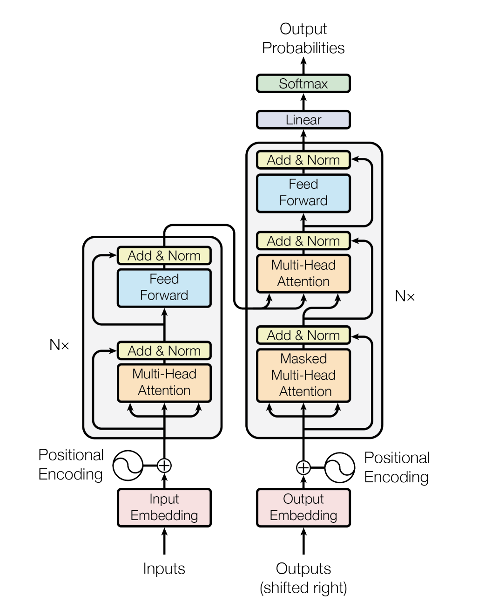
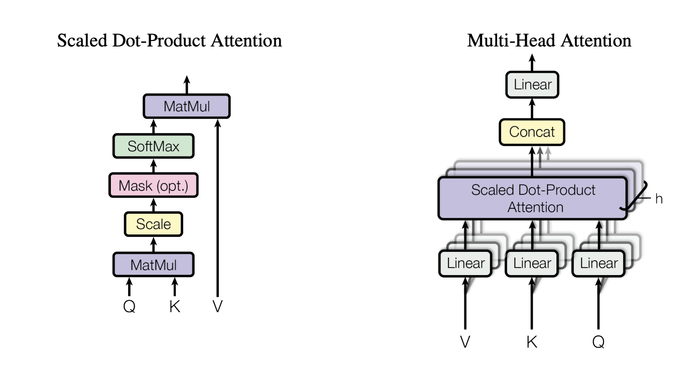
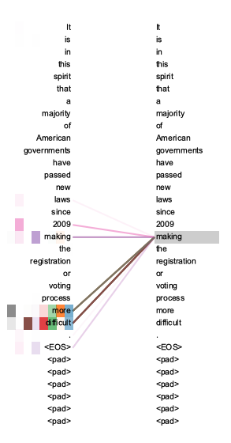
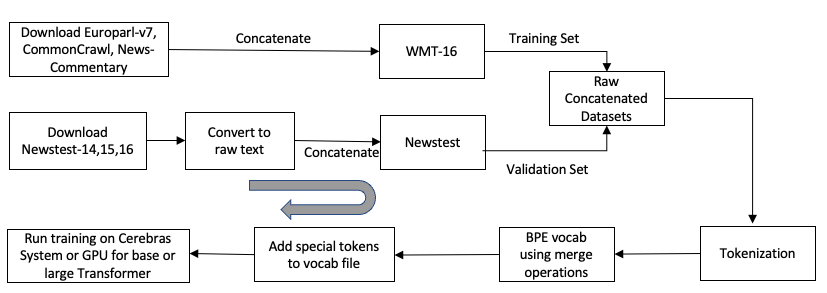

# Transformer

- [Transformer architecture](#transformer-architecture)
  - [Encoder](#encoder)
  - [Decoder](#decoder)
  - [Self-attention](#self-attention)
  - [Multi-head attention](#multi-head-attention)
  - [Masked multi-head attention](#masked-multi-head-attention)
  - [Position-wise feed-forward network](#position-wise-feed-forward-network)
- [Sequence of the steps to perform](#sequence-of-the-steps-to-perform)
- [Key features used from CSoft platform](#key-features-used-from-csoft-platform)
- [Structure of the code](#structure-of-the-code)
- [Prepare dataset](#prepare-dataset)
- [Transformer input function](#transformer-input-function)
  - [Transformer features dictionary](#transformer-features-dictionary)
  - [Transformer label tensor](#transformer-label-tensor)
- [Run training](#run-training)
- [To compile/validate, run train and eval on Cerebras System](#to-compilevalidate-run-train-and-eval-on-cerebras-system)
- [To run train and eval on GPU/CPU](#to-run-train-and-eval-on-gpucpu)
  - [Distributed data-parallel training on GPU](#distributed-data-parallel-training-on-gpu)
- [Configuration files included for this model](#configuration-files-included-for-this-model)
- [Citations](#citations)


## Transformer architecture

Transformer [[1]](https://arxiv.org/pdf/1706.03762.pdf) is an encoder-decoder style natural language processing model primarily used for sequence transduction tasks such as machine translation, sequence to sequence applications etc.

Following diagram illustrates the Transformer [[1]](https://arxiv.org/pdf/1706.03762.pdf) architecture:



This model leverages the attention mechanism introduced in [[2]](https://arxiv.org/abs/1409.0473?context=cs.NE). Transformer [[1]](https://arxiv.org/pdf/1706.03762.pdf) model expands on the [Bahdanau attention](https://arxiv.org/abs/1409.0473?context=cs.NE) by introducing i) [self-attention](#self-attention) for encoder module, ii) [multiple attention heads](#multi-head-attention) to understand different sets of semantics in the input text, and iii) [masked attention](#masked-multi-head-attention) from decoder to encoder  to exploit the semantic dependencies between the current token to be generated, the tokens already generated and sequence of the input tokens. It also adds a [positional embedding layer](#https://openreview.net/pdf?id=onxoVA9FxMw) on top of word embeddings to preserve the order of the input tokens.

The main building blocks of the Transformer [[1]](https://arxiv.org/pdf/1706.03762.pdf) model are:
* [Encoder](#encoder)
* [Decoder](#decoder)

### Encoder
This consists of multiple identical encoder blocks. Each of these blocks has the following sub-layers:
* [Multi-head attention](#multi-head-attention)
* [Position-wise feed-forward network](#position-wise-feed-forward-network)

The sub-layers are arranged in the encoder block as `LayerNorm(x + Sublayer(x))`. This means that the output of each sub-layer
is added with its input to build a residual connection and then passed to a `LayerNorm` layer as illustrated in the diagram above. 
Note that the [multi-head attention](#multi-head-attention) mechanism is the first sub-layer and the [position-wise feed forward network](#position-wise-feed-forward-network) is the second sub-layer.

### Decoder
This consists of multiple identical decoder blocks. Each of the decoder blocks has the following sub-layers:
* [Masked multi-head attention using encoder outputs](#masked-multi-head-attention)
* [Multi-head attention](#multi-head-attention)
* [Position-wise feed forward network](#position-wise-feed-forward-network)

The sub-layers in the decoder block are arranged exactly as the encoder block except that there is an additional [masked multi-head attention](#masked-multi-head-attention) sub-layer.
### Self-attention
Self-Attention is the mechanism by which the Transformer [[1]](https://arxiv.org/pdf/1706.03762.pdf) model encodes the information of relevant words in the sequence while processing the current word in the sequence. For example in the sentence, 'The animal didn't cross the street because it was too tired', 'it' can correspond to 'animal' or 'street' so to make sure 'it' refers correctly to 'animal', [self-attention](#self-attention) assigns a higher weight to 'animal' while encoding 'it'.  
An attention function maps a `query` and a set of `key-value pairs` to an output,
where the `query`, `keys`, `values`, and the output are all vectors. The output is computed as a weighted sum
of the `values`, where the weight assigned to each value is computed by a compatibility function of the
`query` with the corresponding `key` [[1]](https://arxiv.org/pdf/1706.03762.pdf). 


<!--  -->


### Multi-head attention
Multi-Head attention uses multiple attention heads which operate on linearly projected
`queries`, `keys` and `values`.The outputs from the attention function are concatenated and
passed through an output projection layer. It facilitates a joint encoding of a token by attending to information from different representation subspaces. For example, in the diagram below, the encoding of the token 'making' comprises of a mixture of other tokens represented by the multi-coloured segments. Multiple attention heads attend to different and distant dependencies for the word 'making'. 



### Masked multi-head attention
Masked multi-head attention in each [decoder block](#decoder) uses `keys` and `values` from the final encoder layer
and operates on queries obtained from the output of the previous decoder block when computing attention output.


### Position-wise feed-forward network
The feed-forward network in [encoder](#encoder) and [decoder](#decoder) blocks can be described as `FFN(x) = max(0, xW1 + b1)W2 + b2`
which translates to two linear layers with a ReLU [[4]](https://www.cs.toronto.edu/~fritz/absps/reluICML.pdf) activation in between them.

## Sequence of the steps to perform
Following block diagram illutrates the sequence of steps you would perform to run pre-training.


## Key features used from CSoft platform 
By default, this model is configured to use [Variable Sequence Length (VSL)](https://docs.cerebras.net/en/latest/tensorflow-docs/tf-vsl.html) or more generally [Variable Tensor Shape (VTS)](https://docs.cerebras.net/en/latest/pytorch-docs/pytorch-vts.html)  mode when training on CS system. When running in the VSL mode, the CS system does not perform any computation on padding tokens. This has the potential for substantial training speedups. The VSL mode can be disabled by setting `model.use_vsl: False` in the appropriate config file. In order to take full advantage of the potential speedups from VSL, it is helpful to batch samples such that every sample in a given batch has a similar length. Accordingly, for Transformer [[1]](https://arxiv.org/pdf/1706.03762.pdf) pretraining we bucket samples of similar lengths together before batching. The boundaries between different buckets are defined by `train_input.num_buckets` argument in the config file.

[Pipeline execution mode](https://docs.cerebras.net/en/latest/cerebras-basics/cerebras-execution-modes.html#layer-pipelined-mode) is supported by CS system for the Transformer [[1]](https://arxiv.org/pdf/1706.03762.pdf) model. In this mode all the layers of the network are loaded altogether onto the CS system. This mode is selected for neural network models of a standard size, or even smaller.
[Multi-replica training](https://docs.cerebras.net/en/latest/general/multi-replica-data-parallel-training.html) is also supported in the pipeline mode to run data parallel training. This is similar to how multiple GPUs are used to accelerate training of a single model. Multiple copies of the model reside on the CS system and different batches of data are streamed to each copy of the model. The losses computed by the individual replicas are combined together and sent to the chief (master copy) as a single loss quantity.

CS system also supports training in [weight streaming execution mode](https://docs.cerebras.net/en/latest/cerebras-basics/cerebras-execution-modes.html#weight-streaming). Following are some of the characteristics of this mode:
1. Activations are stored and read on the wafer.
2. Gradients are stored off the wafer and are streamed in.
3. Weights reside off the wafer and are updated off the wafer by making use of the streamed gradients, store the weights off the wafer and stream the updated weights back into the wafer.

## Structure of the code
* `configs/`: YAML configuration files for Transformer [[1]](https://arxiv.org/pdf/1706.03762.pdf) [model variants](#configuration-files-included-for-this-model).
* `input/`: Input pipeline implementation based on the [WMT-2016](https://www.statmt.org/wmt16/it-translation-task.html) (Workshop on Statistical Machine Translation-2016) English to German machine translation dataset. This directory also contains the scripts you can use to download and prepare the WMT-16 dataset.
* `Transformer.py`: A bulk of the model is defined in this script. It inherits from the central `BaseModel` located in `common/tf/BaseModel.py`. The model also uses Cerebras-defined layers that are located in `common/layers/tf`.
* `data.py`: The entry point to the data input pipeline code. It defines `input_fn`.
* `model.py`: The entry point to the model. Defines `model_fn`.
* `run.py`: Training script. Performs training and validation.
* `utils.py`: Miscellaneous scripts, including `get_params` to parse the `params` dictionary from the `YAML` files and set default values for `params`.

## Prepare dataset
[WMT-2016](https://www.statmt.org/wmt16/it-translation-task.html) is a publicly-available English to German machine translation dataset. This dataset can be downloaded, extracted and tokenized  using the tools available in the [Moses git repository](https://github.com/moses-smt/mosesdecoder). Following commands can be used to prepare the dataset.

```bash
cd ./input/data_processing
source wmt16_en_de.sh
```

Note that the data processing may take a noticeable amount of time depending upon your hardware and number of cores. You may find some of the processes have stalled but this need not be of concern as the data processing job will complete. 
Above commands will exectute the following steps and store the processed files under `./wmt16_de_en/data`

* Download data from WMT16 webpage. This consists of `Europarl-v7`, `CommonCrawl` and `News-Commentary corpora`.
* Concatenate the above datasets to form the training dataset.
* Convert `newstest2014`, `newstest2015` and `newstest2016` into raw text and concatenate to create validation dataset.
* Process raw files using [Mosesdecoder]((https://github.com/moses-smt/mosesdecoder)) repo. 
* Perform tokenization.
* Create shared byte-pair encoding vocabulary using merge operations.
* Add special tokens to the beginning of the vocabulary files.

After performing the above steps, it will create a directory `wmt_de_en` which contains training and validation data for the `WMT 2016` translation task. The files with extension `.de` refer to the target `German` language data whereas `.en` extension files correspond to the source `English` language data. Following are some of the files of interest that will be produced after executing the above commands:

* `wmt16_en_de/train.tok.clean.bpe.32000.en` is the source data file which contains tokenized `English` language sentences used for training.
* `wmt16_en_de/train.tok.clean.bpe.32000.de` is the target data file which contains tokenized `German` language sentences used for training.
* `wmt16_en_de/newstest2014.tok.clean.bpe.32000.en` is the source data file which contains tokenized `English` language sentences used for evaluation. 
* `wmt16_en_de/newstest2014.tok.clean.bpe.32000.de` is the target data file which contains tokenized `German` language sentences used for evaluation.
* `wmt16_en_de/vocab.bpe.32000.en` is the source data vocabulary which contains byte pair encoded tokens for the `English` language text.
* `wmt16_en_de/vocab.bpe.32000.de` is the target data vocabulary which contains byte pair encoded tokens for the `German` language text.

## Transformer input function
The input function, `TransformerDynamicDataProcessor`, consumes the processed data as described in the previous section.

This section describes the input data format expected by the model input function in case you would like to create your own dataloader. You need to ensure that the Transformer [[1]](https://arxiv.org/pdf/1706.03762.pdf) `feature dictionary` and `label tensor` are as described below.

### Transformer features dictionary
The features dictionary has the following key-value pairs:

`encoder_input_ids`: Encoder's input token IDs, padded with `0`s to `src_max_sequence_length`. Contains tokens for the source language that the model is expected to translate.
- Shape: `[batch_size, src_max_sequence_length]`.
- Type: `tf.int32`.

`encoder_mask`: Mask for padded positions. Has `1`s on the encoder's input ids padded positions
and `0`s elsewhere.

- Shape: `[batch_size, src_max_sequence_length]`.
- Type: `tf.int32`.

`encoder_input_length`: Length of `encoder_input_ids` excluding `pad` tokens

- Shape: `[batch_size, ]`.
- Type: `tf.int32`.


`decoder_input_ids`: Decoder's input token IDs, padded with `0`s to `tgt_max_sequence_length`. Contains the tokens in target language corresponding to tokens in `encoder_input_ids`
- Shape: `[batch_size, tgt_max_sequence_length]`.
- Type: `tf.int32`.

`decoder_mask`: Mask for padded positions. Has `1`s on the decoder's input ids padded positions
and `0`s elsewhere.

- Shape: `[batch_size, tgt_max_sequence_length]`.
- Type: `tf.int32`.

`decoder_input_length`: Length of `decoder_input_ids` excluding `pad` tokens

- Shape: `[batch_size, ]`.
- Type: `tf.int32`.

### Transformer label tensor

Decoder's output token IDs appended by the `end-of-sequence` token. We shift the `decoder_input_ids` to the right and append it by `a end-of-sequence` token.

- Shape: `[batch_size, tgt_max_sequence_length]`.
- Type: `tf.int32`.


## Run training

Transformer [[1]](https://arxiv.org/pdf/1706.03762.pdf) mdoel is trained using the 'teacher forcing mechanism' [[5]](https://citeseerx.ist.psu.edu/viewdoc/download;jsessionid=BC0D1411BED1595BCFF814B6B7B88E74?doi=10.1.1.52.9724&rep=rep1&type=pdf). This means that during the training, we feed a source language sequence to the encoder input and a corresponding target language sequence to the decoder as input. The expected label sequence is the target language sequence shifted to the right and appended by a end of sequence special token. 

 The Transformer [[1]](https://arxiv.org/pdf/1706.03762.pdf) model has two variants `base` and `large`. These can be selected by using the appropriate [config file](##configuration-files-included-for-this-model). 

## To compile/validate, run train and eval on Cerebras System

Please follow the instructions on our Developer Docs at:
https://docs.cerebras.net/en/latest/getting-started/cs-tf-quickstart.html

## To run train and eval on GPU/CPU

If running on a cpu or gpu, activate the environment from [Python GPU Environment setup](../../../../PYTHON-SETUP.md), and simply run:

```bash
python run.py --mode train --params /path/to/yaml --model_dir /path/to/model_dir
```

#### Distributed data-parallel training on GPU

When training is executed in a multi-GPU setup, the batch size specified in the config file is treated as per-device batch size. To obtain the effective batch size you should multiply the batch size value in the config file by the number of GPUs. When you switch between the training on the GPUs and on the CS system, it is important to take this into account to ensure that you use a proper batch size.

## Configuration files included for this model

This repository facilitates training two Transformer [model variants]
(#supported-model-variants). The config files are located under [configs](configs). 
* `configs/paras_base.yaml` trains a `base` Transformer model with `6` encoder and decoder layers, `8` attention heads and `512` as the `hidden size`.
* `configs/paras_large.yaml` trains a `base` Transformer model with `6` encoder and decoder layers, `16` attention heads and `1024` as the `hidden size`.

All configs are meant for running in Pipeline mode with Appliance mode and Kubernetes. Slurm flow is available as a legacy support.

## Citations
[1] [Attention Is All You Need by Vaswani, et al.](https://arxiv.org/pdf/1706.03762.pdf), 2017.

[2] [Neural Machine Translation by Jointly Learning to Align and Translate
by Bahdanau et. al.](https://arxiv.org/abs/1409.0473?context=cs.NE), 2014.

[3] [Illustrated Transformer](https://jalammar.github.io/illustrated-transformer/)

[4] [Rectified Linear Units Improve Restricted Boltzmann Machines by Nair et. al.](https://www.cs.toronto.edu/~fritz/absps/reluICML.pdf), 2010. 

[5] [A Learning Algorithm for Continually Running Fully
Recurrent Neural Network by Williams et. al.](https://citeseerx.ist.psu.edu/viewdoc/download;jsessionid=BC0D1411BED1595BCFF814B6B7B88E74?doi=10.1.1.52.9724&rep=rep1&type=pdf), 1989.


