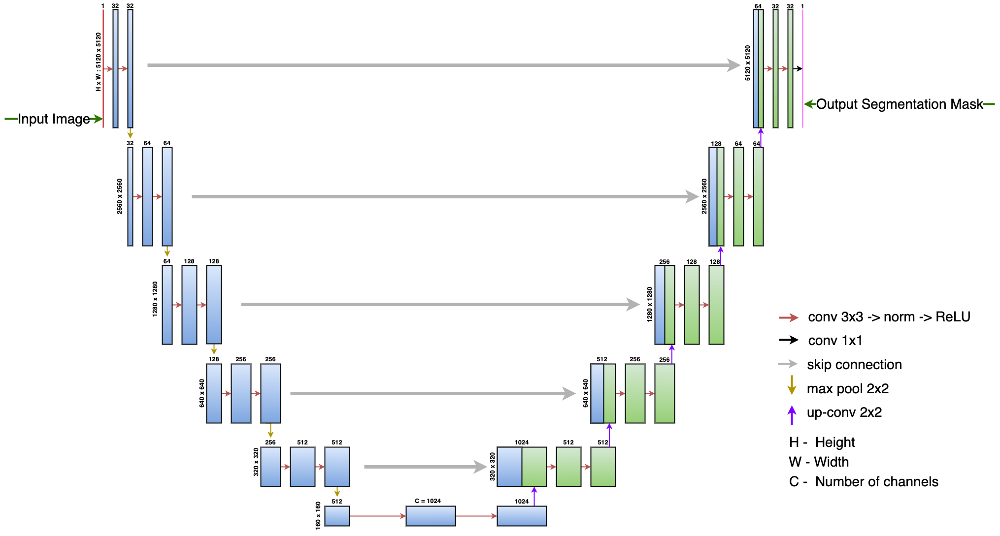
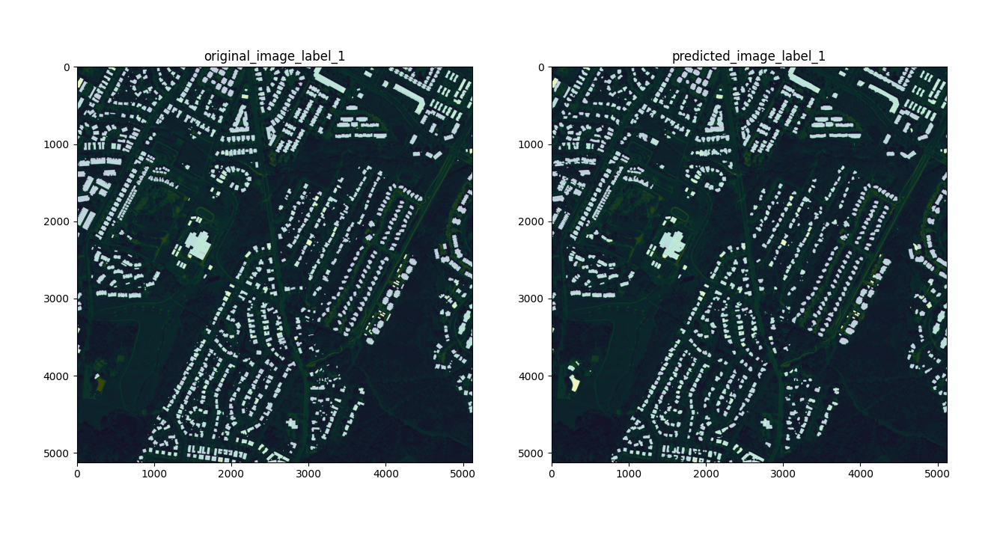

# U-Net

- [U-Net](#u-net)
  - [Introduction](#introduction)
      - [U-Net model](#u-net-model)
  - [Structure of the code](#structure-of-the-code)
  - [Data Preparation](#data-preparation)
    - [Severstal Steel Defect Detection dataset](#severstal-steel-defect-detection-dataset)
      - [Download](#download)
      - [Run with Data Processors](#run-with-data-processors)
      - [Generate HDF5 files for Hdf5DataProcessor](#generate-hdf5-files-for-hdf5dataprocessor)
    - [Inria-Aerial Image Labeling Dataset](#inria-aerial-image-labeling-dataset)
      - [Download](#download-1)
      - [Run with Data Processors](#run-with-data-processors-1)
      - [To resize images to desired shape](#to-resize-images-to-desired-shape)
  - [Configuration files included for this model](#configuration-files-included-for-this-model)
  - [How to run](#how-to-run)
    - [To compile, validate, run train and eval on Cerebras System](#to-compile-validate-run-train-and-eval-on-cerebras-system)
    - [To run train and eval on GPU/CPU](#to-run-train-and-eval-on-gpucpu)
  - [Results](#results)
  - [Citations](#citations)
 

## Introduction

#### U-Net model
UNet [[4]](https://lmb.informatik.uni-freiburg.de/Publications/2015/RFB15a/) is a convolutional neural network that was developed for biomedical image segmentation at the Computer Science Department of the University of Freiburg, Germany. The network is a fully convolutional network.

The architecture consists of an encoder block which is a contracting path that captures context and a symmetric decoder block which is an expanding path for precise localization[[4]](https://lmb.informatik.uni-freiburg.de/Publications/2015/RFB15a/).



*Figure 1: Model architecture of U-Net based on configs/params_inria_aerial_5120.yaml*

## Structure of the code

-   `configs/`: YAML configuration files.
-   `data.py`: The entry point to the data input pipeline code. Defines `train_input_dataloader` ( and `eval_input_dataloader`) which initalizes the data processor mentioned in config yaml `train_input.data_processor`( and `eval_input.data_processor`)
-   `modeling_unet.py`: Defines the core model `UNet`.
-   `model.py`: The entry point to the model. Defines `UNetModel`.
-   `run.py`: Training script. Performs training and validation.
-   `utils.py`: Miscellaneous scripts to parse the `params` dictionary from the YAML files.

## Data Preparation

### Severstal Steel Defect Detection dataset

#### Download
Severstal dataset provides images of surface defects on steel sheets from high frequency cameras. These images also come with labeled ground truth segmentation masks. The goal of the dataset is develop algorithms to detect and localize these defects[[1]](https://www.kaggle.com/competitions/severstal-steel-defect-detection).

The dataset can be downloaded from [Kaggle competition page](https://www.kaggle.com/competitions/severstal-steel-defect-detection/data).

#### Run with Data Processors
This dataset can be used with [SeverstalBinaryClassDataProcessor.py](./input/SeverstalBinaryClassDataProcessor.py) which uses a map-style PyTorch Dataset[[5]](https://pytorch.org/docs/stable/data.html#map-style-datasets) (or) with [Hdf5DataProcessor.py](./input/Hdf5DataProcessor.py) which uses an iterable-style PyTorch Dataset[[6]](https://pytorch.org/docs/stable/data.html#iterable-style-datasets).

Currently, we support Binary class Segmentation. The class to be considered as positive label can be set in the yaml `train_input.class_id`

#### Generate HDF5 files for Hdf5DataProcessor
Inorder to use the iterable-style PyTorch dataset[[6]](https://pytorch.org/docs/stable/data.html#iterable-style-datasets) and corresponding dataprocessor [Hdf5DataProcessor.py](./input/Hdf5DataProcessor.py), we need to generate HDF5 files using the script [create_hdf5_files.py](./input/scripts/create_hdf5_files.py)

```python
Usage:
# For help:
    python create_hdf5_files.py -h
```
```python
# Step-1:
    (a). Set image shape to desired shape in 
    `train_input.image_shape` and `eval_input.image_shape` 
    i.e. [H, W, 1] in config: 
    /path_to_modelzoo/vision/pytorch/unet/configs/params_severstal_binary.yaml
    (b). Set the desired class to be considered in `train_input.class_id`
    (c). Set the desired `train` and `val` splits in `train_input.train_test_split`
```
```python
# Step-2: Run the script 
python modelzoo/vision/pytorch/unet/input/scripts/create_hdf5_files.py --params=/path_to_modelzoo/vision/pytorch/unet/configs/params_severstal_binary.yaml --output_dir=/path_to_outdir/severstal_binary_classid_3_hdf --num_output_files=10 --num_processes=5
```

### Inria-Aerial Image Labeling Dataset
Inria-Aerial dataset comprises of high resolution aerial imagery of various geographical locations ranging from densely populated areas to alpine towns. The images provided by the benchmark are of size 5000 x 5000. The goal of the dataset is to identify buildings from aerial imagery [[2]](https://project.inria.fr/aerialimagelabeling/)[[3]](https://hal.inria.fr/hal-01468452/document).

#### Download
The dataset can be downloaded from [[2]](https://project.inria.fr/aerialimagelabeling/) after registering as a user.


#### Run with Data Processors
This dataset can be used with [InriaAerialDataProcessor.py](./input/InriaAerialDataProcessor.py) which uses a map-style PyTorch Dataset[[5]](https://pytorch.org/docs/stable/data.html#map-style-datasets).
We set aside 15 images (`train/images/austin{34,19,10}.tif`, `train/images/chicago{6,22,18}.tif`, `train/images/kitsap{18,4,26}.tif`, `train/images/tyrol-w{19,26,22}.tif`, `train/images/vienna{1,23,18}.tif`) to be used as validation dataset to measure model performance using mIOU metrics.

#### To resize images to desired shape
Using image shapes which are power of 2 yields the best performance on CS systems. Also, note that the shape of the input (height and width) passed to model should be such that the output feature maps from Encoder blocks are divisible by 2.
In this regard, to resize the images, the script [resize_inria_files.py](./input/scripts/resize_inria_files.py) can be used.


```python
Usage:
# For help:
    python resize_inria_files.py -h
```

```python
# Run the script 
python modelzoo/vision/pytorch/unet/input/scripts/resize_inria_files.py --input_dir=/path_to_raw_inria_dataset_folder --output_dir=/path_to_resized_images_folder --width=5120 --height=5120 --transform=resize

```


## Configuration files included for this model

We provide the following config file for U-Net located under the [configs](configs) directory. 

* [configs/params_inria_aerial_5120.yaml](./configs/params_inria_aerial_5120.yaml): U-Net model with 28 Convolution layers and best converging config for Inria-aerial dataset with image size 5120 x 5120.
* [configs/params_severstal_binary_5K.yaml](./configs/params_severstal_binary_5K.yaml): U-Net model with 18 Convolution layers and uses iterable-style PyTorch Dataloader `Hdf5DataProcessor.py` for Severstal Dataset of image size 5120 x 5120.
* [configs/params_severstal_binary_hdf5.yaml](configs/params_severstal_binary_hdf5.yaml): U-Net model with 18 Convolution layers and uses iterable-style PyTorch Dataloader `Hdf5DataProcessor.py` for Severstal Dataset of image size 256 x 256 .
* [configs/params_severstal_binary.yaml](./configs/params_severstal_binary.yaml): U-Net model with 18 Convolution layers and uses map-style PyTorch Dataloader `SeverstalBinaryClassDataProcessor.py` for Severstal Dataset of image size 256 x 256


## How to run

**Parameter settings in YAML config file**: The config YAML files are located in the [configs](configs/) directory. Please check the following fields before launching training:

-   The `train_input.data_dir` parameter points to the correct dataset
-   The `train_input.data_processor` parameter corresponds to the correct dataloader.


**YAML config files**: Details on the configs for this model can be found in [Configuration files included for this model](#configuration-files-included-for-this-model)

In the following example run commands, we use `/path/to/yaml`, `/path/to/model_dir`, and `train` as placeholders for user supplied inputs.

-   `/path/to/yaml` is a path to the YAML config file with model parameters such one of the configurations described in [Configs included for this model](#configs-included-for-this-model).
-   `/path/to/model_dir` is a path to the directory where you would like to store the logs and other artifacts of the run.
-   `--mode` specifies the desired mode to run the model in. Change to `--mode eval` to run in eval mode.

### To compile, validate, run train and eval on Cerebras System

Please follow the instructions on our Developer Docs at:
http://docs.cerebras.net/en/latest/getting-started/pytorch/cs-pytorch-ws-appliance-mode.html

We suggest setting `num_workers_per_csx` to `8` for best performance (samples/sec).

### To run train and eval on GPU/CPU

If running on a cpu or gpu, activate the environment from [Python GPU Environment setup](../../../../PYTHON-SETUP.md), and simply run:

```
python run.py --mode train --params /path/to/yaml --model_dir /path/to/model_dir
```

## Results



*Figure 2: Sample Results from Inria-Aerial dataset on image `austin19.tif`*


## Citations
[1] [Severstal Steel Defect Detection](https://www.kaggle.com/competitions/severstal-steel-defect-detection/), July 2019.

[2] [Inria Aerial Image Labeling Dataset Webpage](https://project.inria.fr/aerialimagelabeling/), July 2017.

[3] [Can Semantic Labeling Methods Generalize to Any
City? The Inria Aerial Image Labeling Benchmark](https://hal.inria.fr/hal-01468452/document), July 2017.

[4] [U-Net: Convolutional Networks for Biomedical Image Segmentation](https://lmb.informatik.uni-freiburg.de/Publications/2015/RFB15a/), November 2015.

[5] [Map-style Dataset](https://pytorch.org/docs/stable/data.html#map-style-datasets)

[6] [Iterable-styee Dataset](https://pytorch.org/docs/stable/data.html#iterable-style-datasets)