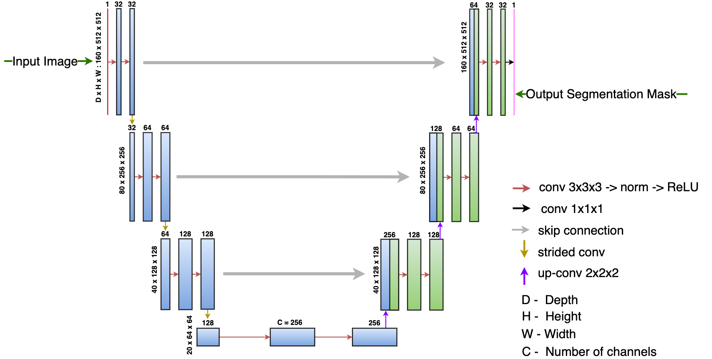

# U-Net

- [U-Net](#u-net)
  - [Introduction](#introduction)
      - [U-Net 2D model](#u-net-2d-model)
      - [U-Net 3D model](#u-net-3d-model)
  - [Structure of the code](#structure-of-the-code)
  - [Data Preparation](#data-preparation)
  - [Configuration files included for this model](#configuration-files-included-for-this-model)
    - [2D configs](#2d-configs)
    - [3D configs](#3d-configs)
  - [How to run](#how-to-run)
    - [To compile, validate, run train and eval on Cerebras System](#to-compile-validate-run-train-and-eval-on-cerebras-system)
    - [To run train and eval on GPU/CPU](#to-run-train-and-eval-on-gpucpu)
  - [Results](#results)
  - [Citations](#citations)

## Introduction

#### U-Net 2D model
UNet-2D [[4]](https://lmb.informatik.uni-freiburg.de/Publications/2015/RFB15a/) is a convolutional neural network that was developed for biomedical image segmentation at the Computer Science Department of the University of Freiburg, Germany. The network is a fully convolutional network.

The architecture consists of an encoder block which is a contracting path that captures context and a symmetric decoder block which is an expanding path for precise localization[[4]](https://lmb.informatik.uni-freiburg.de/Publications/2015/RFB15a/).


*Figure 1: Model architecture of U-Net based on [configs/params_inria_aerial_5120.yaml](./configs/params_inria_aerial_5120_RGB.yaml)*

#### U-Net 3D model
UNet-3D [[9]](https://arxiv.org/abs/1606.06650) was developed for segmentation of 3-D biomedical images. It has the same encoder/decoder structure as described above for UNet-2D but with the 2D operations replaced by their 3D counterparts.


*Figure 2: Model architecture of U-Net 3D based on [configs/params_skm_tea.yaml](./configs/params_skm_tea.yaml). This variant of the model uses strided convolutions for downsampling in place of the max pool operations used in the UNet-2D model*


## Structure of the code

-   `configs/`: YAML configuration files.
-   `data.py`: The entry point to the data input pipeline code. Defines `train_input_dataloader` ( and `eval_input_dataloader`) which initalizes the data processor mentioned in config yaml `train_input.data_processor`( and `eval_input.data_processor`)
-   `modeling_unet.py`: Defines the core model `UNet`.
-   `model.py`: The entry point to the model. Defines `UNetModel`.
-   `run.py`: Training script. Performs training and validation.
-   `utils.py`: Miscellaneous scripts to parse the `params` dictionary from the YAML files.

## Data Preparation

A number of our configurations require running a preprocessing script:

| Dataset | Preprocessing Script | README |
| ------------- | ------------- | ------------- |
| Severstal | [`create_hdf5_files.py`](./input/scripts/create_hdf5_files.py) | [`create_hdf5_files.md`](./input/scripts/README/create_hdf5_files.md) |
| Inria Aerial | [`resize_inria_files.py`](./input/scripts/resize_inria_files.py) | [`resize_inria_files.md`](./input/scripts/README/resize_inria_files.md) |
| SKM-TEA | [`resize_skm_tea_files.py`](./input/scripts/resize_skm_tea_files.py) | [`resize_skm_tea_files.md`](./input/scripts/README/resize_skm_tea_files.md) |

## Configuration files included for this model

We provide the following config file for U-Net located under the [configs](configs) directory.

### 2D configs
| Config File | Dataset | Data Processor | Num. Convs. | Input Shape |
| ------------- | ------------- | ------------- | ------------- | ------------- |
| [params_cityscapes.yaml](./configs/params_cityscapes.yaml) | [Cityscapes](https://www.cityscapes-dataset.com/) |[CityscapesDataProcessor](./input/CityscapesDataProcessor.py) | 23 | 256 x 512 x 3 |
| [params_inria_aerial_5120_RGB.yaml](./configs/params_inria_aerial_5120_RGB.yaml) | [Inria-Aerial](https://project.inria.fr/aerialimagelabeling/) | [InriaAerialDataProcessor](./input/InriaAerialDataProcessor.py)| 28 | 5120 x 5120 x 3|
| [params_inria_aerial_7168.yaml](./configs/params_inria_aerial_7168.yaml) | [Inria-Aerial](https://project.inria.fr/aerialimagelabeling/)  | [InriaAerialDataProcessor](./input/InriaAerialDataProcessor.py) | 18 | 7168 x 7168 x 1 |
| [params_severstal_binary.yaml](./configs/params_severstal_binary.yaml) | [Severstal](https://www.kaggle.com/competitions/severstal-steel-defect-detection/) | [SeverstalBinaryClassDataProcessor](./input/SeverstalBinaryClassDataProcessor.py) | 18 | 256 x 256 |

### 3D configs
| Config File | Dataset | Data Processor | Num. Convs. | Input Shape |
| ------------- | ------------- | ------------- | ------------- | ------------- |
| [params_skm_tea.yaml](./configs/params_skm_tea.yaml) | [SKM-TEA](https://github.com/StanfordMIMI/skm-tea) | [SkmDataProcessor](./input/SkmDataProcessor.py) | 18 | 512 x 512 x 160 |

## How to run

**Parameter settings in YAML config file**: The config YAML files are located in the [configs](configs/) directory. Please check the following fields before launching training:

-   The `train_input.data_dir` parameter points to the correct dataset
-   The `train_input.data_processor` parameter corresponds to the correct dataloader.


**YAML config files**: Details on the configs for this model can be found in [Configuration files included for this model](#configuration-files-included-for-this-model)

In the following example run commands, we use `/path/to/yaml`, `/path/to/model_dir`, and `train` as placeholders for user supplied inputs.

-   `/path/to/yaml` is a path to the YAML config file with model parameters such one of the configurations described in [Configs included for this model](#configs-included-for-this-model).
-   `/path/to/model_dir` is a path to the directory where you would like to store the logs and other artifacts of the run.
-   `--mode` specifies the desired mode to run the model in. Change to `--mode eval` to run in eval mode.

### To compile, validate, run train and eval on Cerebras System

Please follow the instructions on our [quickstart in the Developer Docs](https://docs.cerebras.net/en/latest/wsc/getting-started/cs-appliance.html).

We suggest setting `num_workers_per_csx` to `8` for best performance (samples/sec).


### To run train and eval on GPU/CPU

If running on a cpu or gpu, activate the environment from [Python GPU Environment setup](../../../../PYTHON-SETUP.md), and simply run:

```
python run.py [GPU, CPU] --mode train --params /path/to/yaml --model_dir /path/to/model_dir
```

## Results


*Figure 3: Sample Results from Inria-Aerial dataset on image `austin19.tif`*


## Citations
[1] [Severstal Steel Defect Detection](https://www.kaggle.com/competitions/severstal-steel-defect-detection/), July 2019.

[2] [Inria Aerial Image Labeling Dataset Webpage](https://project.inria.fr/aerialimagelabeling/), July 2017.

[3] [Can Semantic Labeling Methods Generalize to Any
City? The Inria Aerial Image Labeling Benchmark](https://hal.inria.fr/hal-01468452/document), July 2017.

[4] [U-Net: Convolutional Networks for Biomedical Image Segmentation](https://lmb.informatik.uni-freiburg.de/Publications/2015/RFB15a/), November 2015.

[5] [Map-style Dataset](https://pytorch.org/docs/stable/data.html#map-style-datasets)

[6] [Iterable-style Dataset](https://pytorch.org/docs/stable/data.html#iterable-style-datasets)

[7] [SKM-TEA Knee MRI Dataset Webpage](https://github.com/StanfordMIMI/skm-tea), August 2021.

[8] [Cityscapes Dataset Webpage](https://www.cityscapes-dataset.com/), February 2016.

[9] [3D U-Net: Learning Dense Volumetric Segmentation from Sparse Annotation](https://arxiv.org/abs/1606.06650), June 2016.
