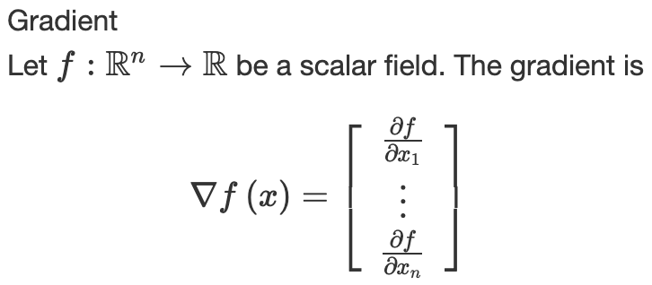

# Convert MathML to Latex

## Introduction

This project provides a Python script to convert MathML into Latex.

## Usage

```bash
./mathml2latex input.md output.md
```

Example `input.md`:

```
Gradient

Let <!--[if mathML]><mml:math xmlns:mml="http://www.w3.org/1998/Math/MathML"><mml:mi>f</mml:mi><mml:mo>:</mml:mo><mml:msup><mml:mi>ℝ</mml:mi><mml:mi>n</mml:mi></mml:msup><mml:mo>→</mml:mo><mml:mi>ℝ</mml:mi></mml:math><![endif]--> be a scalar field. The gradient is

  <!--[if mathML]><mml:math xmlns:mml="http://www.w3.org/1998/Math/MathML" display="block"><mml:mo>∇</mml:mo><mml:mi>f</mml:mi><mml:mfenced><mml:mi>x</mml:mi></mml:mfenced><mml:mo>=</mml:mo><mml:mfenced open="[" close="]"><mml:mrow><mml:mtable><mml:mtr><mml:mtd><mml:maligngroup/><mml:mfrac><mml:mrow><mml:mo>&#120597;</mml:mo><mml:mi>f</mml:mi></mml:mrow><mml:mrow><mml:mo>&#120597;</mml:mo><mml:msub><mml:mi>x</mml:mi><mml:mn>1</mml:mn></mml:msub></mml:mrow></mml:mfrac></mml:mtd></mml:mtr><mml:mtr><mml:mtd><mml:maligngroup/><mml:mo>⋮</mml:mo></mml:mtd></mml:mtr><mml:mtr><mml:mtd><mml:maligngroup/><mml:mfrac><mml:mrow><mml:mo>&#120597;</mml:mo><mml:mi>f</mml:mi></mml:mrow><mml:mrow><mml:mo>&#120597;</mml:mo><mml:msub><mml:mi>x</mml:mi><mml:mi>n</mml:mi></mml:msub></mml:mrow></mml:mfrac></mml:mtd></mml:mtr></mml:mtable></mml:mrow></mml:mfenced></mml:math><![endif]-->
```

Example `output.md`:

```
Gradient
Let $f:{\mathbb{R}}^{n}\to \mathbb{R}$ be a scalar field. The gradient is
  $$\nabla f\left(x\right)=\left[\begin{array}{c}\frac{\mathit{\partial}f}{\mathit{\partial}{x}_{1}}\\ \vdots \\ \frac{\mathit{\partial}f}{\mathit{\partial}{x}_{n}}\end{array}\right]$$
```

`output.md` rendered as:



## Background

I started this little project when attempting to migrate from OneNote to Markdown. I have a large number of math notes with heavy equations, which makes my journey much bumpier.

In OneNote, equations are stored in MathML format; while in Markdown, equations are in the form of Latex.

As this may help others in similar situations, I decided to jot down the approaches to convert OneNote to Markdown below.

There exist at least three ways to do the conversion.

1. **OneNote --> Word --> Markdown**
   This [method](https://github.com/SjoerdV/ConvertOneNote2MarkDown) appears to be the most popular. I found several similar repos on Github.
   There are two steps in this approach:
   * **Step 1**: Export OneNote documents in Word format, i.e. `.docx`
     * This export function is supported in the [standalone version](https://www.onenote.com/download) of OneNote on Windows. I have not found it available on Mac or on the version installed from the Microsoft Store.
   * **Step 2**: Convert Word documents to Markdown with [Pandoc](https://pandoc.org/)
     * This approach has the advantage of being able to export all OneNote documents with a single PowerShell script.
     * However, it is a disaster for my equations. When exporting to `.docx`, all equations are converted into images, which not only breaks the line alignment but also loses the capability of editing equations in the future.
<br/>

2. **OneNote --> HTML --> Markdown**
   This approach is based on the [one2html](https://github.com/msiemens/one2html) project which utilizes the [onenote.rs](https://github.com/msiemens/onenote.rs) parser.

   The converted equations are in the HTML format, rather than the image format. However, the converter does not support MathML which renders the converted equation garbled.
<br/>

3. **OneMark --> Markdown (with MathML) --> Markdown (with Latex)**
   [OneMark](http://neux.studio/) is a great plugin that enables writing OneNote with Markdown syntax. It also comes with a handy function to export OneNote into Markdown.
   This approach consists of two steps:
   * **Step 1**: Export OneNote to Markdown with OneMark
     * Since OneMark only has Windows version, you need to do this on a Windows machine with the standalone version of OneNote.
     * One inefficiency here is that OneMark currently only supports exporting one page at a time. Thus it may be laborious if you have a large number of notes like me.
   * **Step 2**: Convert MathML to Latex in Markdown
     * Equations in the Markdown generated by OneMark are in form of MathML which is not edit-friendly and cannot be displayed in many Markdown editors.
     * To convert MathML to Latex, I write a Python script which results in this repo.

## Mechanism

`mathml2latex.py` detects MathML blocks denoted by `<!--[if mathML]> ... <![endif]-->`. This wrapper block is generated by OneMark.

The conversion of a MathML block is conducted in two phases:

1. Invoke [XSLT MathML](http://xsltml.sourceforge.net/) library to transform MathML structures to Latex markups
<br/>

2. Convert UTF characters to Latex markups
   * XSLT MathML only converts the math structures to Latex markups while leaving UTF symbols like `π` in the literal form.
   * Many Markdown editors fail to recognize these UTF symbols which results in a failure of rendering.
   * Thus, `unicode2latex()` utilizes a lookup table to convert these UTF symbols to Latex markups, e.g. `\pi`

## Related

* [mathconverter](https://github.com/oerpub/mathconverter/) : a nice math converter that inspires this project. Unfortunately it is not Markdown friendly.
