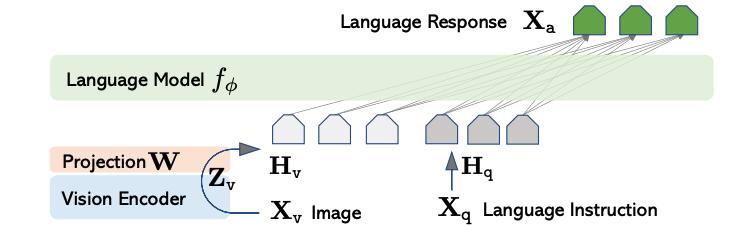
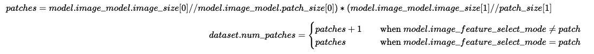

# Multimodal LLaVA
- [Multimodal LLaVA](#multimodal-llava)
  - [Model overview](#model-overview)
  - [Structure of the code](#structure-of-the-code)
  - [Dataset download and preprocessing](#dataset-download-and-preprocessing)
    - [Phase-1: Pre-training for Feature alignment datasets](#phase-1-pre-training-for-feature-alignment-datasets)
      - [LLaVA Visual Instruct Pretrain LCS-558K Dataset](#llava-visual-instruct-pretrain-lcs-558k-dataset)
      - [ShareGPT4V-PT Dataset](#sharegpt4v-pt-dataset)
      - [Synthdog-EN Dataset](#synthdog-en-dataset)
    - [Phase-2: Instruction Finetuning datasets](#phase-2-instruction-finetuning-datasets)
      - [LLaVA Visual Instruct 150K Dataset](#llava-visual-instruct-150k-dataset)
      - [ShareGPT4V-SFT Dataset:](#sharegpt4v-sft-dataset)
      - [ChartQA Dataset](#chartqa-dataset)
      - [DVQA Dataset](#dvqa-dataset)
      - [AI2 Diagram Dataset](#ai2-diagram-dataset)
      - [ArxivQA Dataset](#arxivqa-dataset)
      - [ArxivCap Dataset](#arxivcap-dataset)
      - [DocVQA Dataset](#docvqa-dataset)
  - [Sequence of the steps to perform](#sequence-of-the-steps-to-perform)
    - [Step 1: Dataset download and preparation](#step-1-dataset-download-and-preparation)
    - [Step 2: Generate H5 files for training](#step-2-generate-h5-files-for-training)
      - [Generate files for Phase-1 (Pre-training for Feature alignment) stage](#generate-files-for-phase-1-pre-training-for-feature-alignment-stage)
      - [Generate files for Phase-2 (Instruction Finetuning) stage](#generate-files-for-phase-2-instruction-finetuning-stage)
    - [Step 3: Download pretrained checkpoints for Phase-1](#step-3-download-pretrained-checkpoints-for-phase-1)
    - [Step 4: Convert checkpoints to CS Model Zoo format using checkpoint converter](#step-4-convert-checkpoints-to-cs-model-zoo-format-using-checkpoint-converter)
    - [Step 5: Training the model on CS system or GPU using `run.py`](#step-5-training-the-model-on-cs-system-or-gpu-using-runpy)
      - [To compile/validate, run train and eval on Cerebras System](#to-compilevalidate-run-train-and-eval-on-cerebras-system)
      - [To run train and eval on GPU/CPU](#to-run-train-and-eval-on-gpucpu)
    - [Step 6: Convert checkpoint to source code repository format to run eval](#step-6-convert-checkpoint-to-source-code-repository-format-to-run-eval)
    - [Step 7: Set up source code repository for benchmark evaluation and run evaluation benchmarks](#step-7-set-up-source-code-repository-for-benchmark-evaluation-and-run-evaluation-benchmarks)
  - [Configuration files included for this model](#configuration-files-included-for-this-model)
  - [DataLoader Features Dictionary](#dataloader-features-dictionary)
  - [Implementation notes](#implementation-notes)
  - [Citations](#citations)


## Model overview

This directory contains an implementation for the multimodal LLaVA model. Vision Language models in general accept image and text as inputs, and generate text outputs. The LLaVA model consists of a vision encoder backbone, a language model and a projector module that acts as a bridge between vision model and language model.

In the case of LLaVA, the vision encoder is initialized from pretrained OpenAI CLIP-ViT-L-336/14 weights, and the language model is initialized using Vicuna weights. The projector module which consists of MLP, is initialized using random weights.

LLaVA model is in general trained in two phases as below:
- **Phase 1: Pre-training for Feature alignment**: In this stage, only the projector weights are updated to align the image features with that of LLM word embedding.

- **Phase 2: Instruction Finetuning end-to-end**: In this stage, the model is trained on instruction finetuning data and enables the model with chatbot capabilities. In this stage, usually the LLM and projector weights are trained and the vision encoder remains frozen.

<p align="center">
    
</p>
<p align="center">
    Figure 1: Generic multimodal architecture
</p>

<p align="center">
    
</p>
<p align="center">
    Figure 2: LLaVA architecture
</p>

More details can be found in the Section 4.2 of the paper [[1](https://arxiv.org/pdf/2304.08485.pdf)] and [Step 5: Training the model on CS system or GPU using `run.py`](#step-5-training-the-model-on-cs-system-or-gpu-using-runpy)

Details on all the configs provided can be found [here]


## Structure of the code

-   `configs/`: YAML configuration files.
-   `data.py`: The entry point to the data input pipeline code. Defines `train_input_dataloader` ( and `eval_input_dataloader`) which initalizes the data processor mentioned in config yaml `train_input.data_processor`( and `eval_input.data_processor`)
-   `modeling_llava.py`: Defines the core model `Llava`.
-   `model.py`: The entry point to the model. Defines `LlavaModel`.
-   `run.py`: Training script. Performs training and validation.
-   `utils.py`: Miscellaneous scripts to parse the `params` dictionary from the YAML files.

## Dataset download and preprocessing

Please follow the instructions [here](https://huggingface.co/docs/hub/en/datasets-downloading#using-git) for datasets to be downloaded from HuggingFace Datasets.

Since all datasets on the HuggingFace Hub are Git repositories, the datasets can be downloaded locally by running `git clone`:

```
git lfs install
git clone git@hf.co:datasets/<dataset ID>
```
We provide script [`preprocess_dataset.py`](../../..//data_preparation/multimodal/llava/preprocess_dataset.py) to further pre-process some of the Phase-1 and Phase-2 datasets into the correct LLaVA jsonl formats. Please see the help message to see which datasets are covered and find more details in the below sections regarding each individual datasets. Additionally, we provide an additional utility option `convert_json2jsonl` to convert a folder of json files to jsonl files - the latter will be the input format that the later [HDF5 processing scripts](../../../data_preparation/nlp/hdf5_preprocessing/) will act on.
```
python preprocess_dataset.py -h
usage: Pre-process LLaVa datasets [-h] {ai2d,arxivcap,arxivqa,chartqa,sp_docvqa,infographics_docvqa,dvqa,synthdog_en,convert_json2jsonl} ...

positional arguments:
  {ai2d,arxivcap,arxivqa,chartqa,sp_docvqa,infographics_docvqa,dvqa,synthdog_en,convert_json2jsonl}
    ai2d                Pre-process AI2D dataset
    arxivcap            Pre-process ArxivCAP dataset
    arxivqa             Pre-process ArxivQA dataset
    chartqa             Pre-process ChartQA dataset
    sp_docvqa           Pre-process SP-DocVQA dataset
    infographics_docvqa
                        Pre-process Infographics-DocVQA dataset
    dvqa                Pre-process DVQA dataset
    synthdog_en         Pre-process Synthdog_EN dataset
    convert_json2jsonl  Pre-process json files to jsonl files

optional arguments:
  -h, --help            show this help message and exit

```
```
python preprocess_dataset.py convert_json2jsonl -h
usage: Pre-process LLaVa datasets convert_json2jsonl [-h] --input_dir INPUT_DIR

optional arguments:
  -h, --help            show this help message and exit
  --input_dir INPUT_DIR
                        Path to a folder of json files that need to be converted to jsonl format.
```


Note: **We currently expect all the images under a single parent folder and the relative path of images from different datasets are written under `image_key` in the H5 files generated.**
For example:
   ```
    train_input.img_data_dir
    ├── coco
    ├── gqa
    ├── ocr_vqa
    ├── textvqa
    └── vg
   ```
### Phase-1: Pre-training for Feature alignment datasets
#### LLaVA Visual Instruct Pretrain LCS-558K Dataset
* Download from https://huggingface.co/datasets/liuhaotian/LLaVA-Pretrain
* Dataset and images can be directly downloaded from HuggingFace Hub Datasets using  
  `git clone git@hf.co:datasets/liuhaotian/LLaVA-Pretrain`
* _No further preprocessing is required_

#### ShareGPT4V-PT Dataset
* Download the dataset `share-captioner_coco_lcs_sam_1246k_1107.json` from HuggingFace [here](https://huggingface.co/datasets/Lin-Chen/ShareGPT4V/tree/main).
* This dataset consists of 100K high-quality captions collected from advanced GPT4-Vision and has been expanded to 1.2 million with a caption model trained on this subset.
* Images for this dataset can be downloaded by following the instructions [here](https://github.com/InternLM/InternLM-XComposer/blob/main/projects/ShareGPT4V/docs/Data.md#prepare-images)
* _No further preprocessing is required_

#### Synthdog-EN Dataset
* Download the dataset from HuggingFace: https://huggingface.co/datasets/naver-clova-ix/synthdog-en
* The images for this dataset are present in the parquet files
* Steps for preprocessing dataset: 
  * Place the downloaded files at `/<path>/synthdog-en`
  * Use [`preprocess_dataset.py`](../../..//data_preparation/multimodal/llava/preprocess_dataset.py) to process the data into LLaVa jsonl format. Please see the required input arguments.
  ```
  python preprocess_dataset.py synthdog_en -h
  usage: Pre-process LLaVa datasets synthdog_en [-h] --input_dir INPUT_DIR --output_jsonl_dir OUTPUT_JSONL_DIR --output_parquet_dir OUTPUT_PARQUET_DIR --parquet_range PARQUET_RANGE [PARQUET_RANGE ...] --output_image_dir OUTPUT_IMAGE_DIR --image_prefix IMAGE_PREFIX

  optional arguments:
    -h, --help            show this help message and exit
    --input_dir INPUT_DIR
                          Input directory of Synthdog-EN dataset parquet files.
    --output_jsonl_dir OUTPUT_JSONL_DIR
                          Output directory of Synthdog-EN processed json files with LLaVa jsonl format.
    --output_parquet_dir OUTPUT_PARQUET_DIR
                          Output directory of Synthdog-EN processed parquet files.
    --parquet_range PARQUET_RANGE [PARQUET_RANGE ...]
                          Range of Synthdog-EN parquet files to be selected.
    --output_image_dir OUTPUT_IMAGE_DIR
                          Directory of Synthdog-EN image files.
    --image_prefix IMAGE_PREFIX
                          Relative path prefix for Synthdog-EN image files.
  ```
  * Example command:
  ```
  python preprocess_dataset.py synthdog_en \
  --input_dir=/<path>/synthdog-en/data \
  --output_jsonl_dir=/<path>/synthdog-en/llava_processed_jsons \
  --output_parquet_dir=/<path>/synthdog-en/llava_processed_parquet \
  --parquet_range 3 11 \
  --output_image_dir=/<path>/synthdog-en/images \
  --image_prefix=synthdog-en/images
  ```

### Phase-2: Instruction Finetuning datasets
#### LLaVA Visual Instruct 150K Dataset
 * Download the dataset `llava_v1_5_mix665k.json` from https://huggingface.co/datasets/liuhaotian/LLaVA-Instruct-150K/blob/main/llava_v1_5_mix665k.json
 * Images corresponding to this dataset can be downloaded by following instructions [here](https://github.com/haotian-liu/LLaVA/blob/main/README.md#visual-instruction-tuning)
  *  _No further preprocessing is required_

#### ShareGPT4V-SFT Dataset:
* Download the dataset `sharegpt4v_mix665k_cap23k_coco-ap9k_lcs3k_sam9k_div2k.json` from HuggingFace [here](https://huggingface.co/datasets/Lin-Chen/ShareGPT4V/tree/main).
* This dataset is built by replacing 23K image-text pairs related to the image captioning task in LLaVA-mix-665K with a equivalent subset in collected GPT4V-generated high-quality image-text pairs.
* Images for this dataset can be downloaded by following the instructions [here](https://github.com/InternLM/InternLM-XComposer/blob/main/projects/ShareGPT4V/docs/Data.md#prepare-images)
* _No further preprocessing is required_

#### ChartQA Dataset
*  Download the dataset from HuggingFaceHub Datasets from the link: https://huggingface.co/datasets/ahmed-masry/ChartQA
* Steps for preprocessing dataset: 
  * Place the downloaded files at `/<path>/ChartQA_Dataset`
  * Use [`preprocess_dataset.py`](../../..//data_preparation/multimodal/llava/preprocess_dataset.py) to process the data into LLaVa jsonl format. Please see the required input arguments:
  ```
  python preprocess_dataset.py chartqa -h
  usage: Pre-process LLaVa datasets chartqa [-h] --dataset_folder DATASET_FOLDER

  optional arguments:
    -h, --help            show this help message and exit
    --dataset_folder DATASET_FOLDER
                          Path to the ChartQA dataset folder with the data split folders.
  ```
  * Example command:
  ```
  python preprocess_dataset.py chartqa --dataset_folder /<path>/ChartQA_Dataset
  ```

#### DVQA Dataset
* The dataset can be downloaded by following instructions mentioned in
https://github.com/kushalkafle/DVQA_dataset?tab=readme-ov-file#download-links
* Steps for preprocessing dataset: 
  * Place the downloaded files at `/<path>/DVQA`
  * Use [`preprocess_dataset.py`](../../..//data_preparation/multimodal/llava/preprocess_dataset.py) to process the data into LLaVa jsonl format. Please see the required input arguments:
  ```
  python preprocess_dataset.py dvqa -h
  usage: Pre-process LLaVa datasets dvqa [-h] --dataset_folder DATASET_FOLDER

  optional arguments:
    -h, --help            show this help message and exit
    --dataset_folder DATASET_FOLDER
                          Path to the DVQA dataset folder with the data files.
  ```
  * Example command:
  ```
  python preprocess_dataset.py dvqa --dataset_folder /<path>/DVQA/qa
  ```

#### AI2 Diagram Dataset
* Download the dataset and images using
  ```
  wget https://ai2-public-datasets.s3.amazonaws.com/diagrams/ai2d-all.zip
  ```
* Steps for preprocessing dataset: 
  * Unzip the downloaded zip file to `/<path>/ai2d`
  * Use [`preprocess_dataset.py`](../../..//data_preparation/multimodal/llava/preprocess_dataset.py) to process the data into LLaVa jsonl format. Please see the required input arguments:
  ```
  python preprocess_dataset.py ai2d -h
  usage: Pre-process LLaVa datasets ai2d [-h] --question_dir QUESTION_DIR --output_jsonl_dir OUTPUT_JSONL_DIR

  optional arguments:
    -h, --help            show this help message and exit
    --question_dir QUESTION_DIR
                          Path to the AI2D question directory, which contains json files describing the question and answer corresponding to an image.
    --output_jsonl_dir OUTPUT_JSONL_DIR
                          Folder to write the AI2D output jsonl files, which is in LLaVa format describing the image and associated question and answer.
  ```
  * Example command:
  ```
  python preprocess_dataset.py ai2d --question_dir /<path>/ai2d/questions --output_jsonl_dir /<path>/ai2d/ai2d_llava_jsonl
  ```
#### ArxivQA Dataset
* The dataset can be downloaded from
https://huggingface.co/datasets/MMInstruction/ArxivQA
* Steps for preprocessing dataset: 
  * Place the downloaded files at `/<path>/ArxivQA`
  * Use [`preprocess_dataset.py`](../../..//data_preparation/multimodal/llava/preprocess_dataset.py) to process the data into LLaVa jsonl format. Please see the required input arguments: 
  ```
  python preprocess_dataset.py arxivqa -h
  usage: Pre-process LLaVa datasets arxivqa [-h] --input_file INPUT_FILE --output_jsonl_dir OUTPUT_JSONL_DIR

  optional arguments:
    -h, --help            show this help message and exit
    --input_file INPUT_FILE
                          Path to the ArxivQA question file, which contains the question and answer corresponding to an image.
    --output_jsonl_dir OUTPUT_JSONL_DIR
                          Folder to write the ArxivQA output jsonl files, which is in LLaVa format describing the image and associated question and answer.
  ```
  * Example command:
  ```
  python preprocess_dataset.py arxivqa --input_file /<path>/ArxivQA/arxivqa.jsonl --output_jsonl_dir /<path>/ArxivQA/arxivqa_llava_jsonl
  ```

#### ArxivCap Dataset
* The dataset can be downloaded from https://huggingface.co/datasets/MMInstruction/ArxivCap.
* We process and use only figures with captions. Any subfigures are not included.
* Steps for preprocessing dataset: 
  * Place the downloaded files at `/<path>/ArxivCAP`
  * Use [`preprocess_dataset.py`](../../..//data_preparation/multimodal/llava/preprocess_dataset.py) to process the data into LLaVa jsonl format. Please see the required input arguments:
  ```
  python preprocess_dataset.py arxivqa -h
  usage: Pre-process LLaVa datasets arxivqa [-h] --input_file INPUT_FILE --output_jsonl_dir OUTPUT_JSONL_DIR

  optional arguments:
    -h, --help            show this help message and exit
    --input_file INPUT_FILE
                          Path to the ArxivQA question file, which contains the question and answer corresponding to an image.
    --output_jsonl_dir OUTPUT_JSONL_DIR
                          Folder to write the ArxivQA output jsonl files, which is in LLaVa format describing the image and associated question and answer.
  ```
  * Example command:
  ```
  python preprocess_dataset.py arxivcap \
  --input_dir=/<path>/ArxivCap/data \
  --output_jsonl_dir=/<path>/ArxivCap/llava_processed_jsons \
  --output_parquet_dir=/<path>/ArxivCap/llava_processed_parquet \
  --parquet_range 3 11 \
  --output_image_dir=/<path>/ArxivCap/images \
  --image_prefix=ArxivCap/images
  ```

#### DocVQA Dataset
* Download the dataset following instructions [here](https://www.docvqa.org/datasets/docvqa)
* Registration is required to download the dataset under `Single Document Visual Question Answering`
* Steps for preprocessing dataset: 
  * Place the downloaded files at `/<path>/DocVQA`
  * Use [`preprocess_dataset.py`](../../..//data_preparation/multimodal/llava/preprocess_dataset.py) to process each subset into LLaVa jsonl format. Please see the required input arguments:
  ```
  python preprocess_dataset.py sp_docvqa -h
  usage: Pre-process LLaVa datasets sp_docvqa [-h] --dataset_folder DATASET_FOLDER

  optional arguments:
    -h, --help            show this help message and exit
    --dataset_folder DATASET_FOLDER
                          Path to the SP-DocVQA dataset folder with the data files.


  python preprocess_dataset.py infographics_docvqa -h
  usage: Pre-process LLaVa datasets infographics_docvqa [-h] --dataset_folder DATASET_FOLDER

  optional arguments:
    -h, --help            show this help message and exit
    --dataset_folder DATASET_FOLDER
                          Path to the Inforgraphics-DocVQA dataset folder with the data files.  
  ```
  * Example commands:
  ```
  python preprocess_dataset.py sp_docvqa --dataset_folder /<path>/DocVQA/SP-DocVQA/qa

  python preprocess_dataset.py infographics_docvqa --dataset_folder /<path>/DocVQA/Infographicsvqa/qa
  ```

## Sequence of the steps to perform

The high-level steps for training a model are relatively simple, involving data-processing and then model training and evaluation

-  Step 1: Dataset download and preprocessing
-  Step 2: Generate H5 files for training
   -  Generate files for Phase-1 (Pre-training for Feature alignment) stage
   -  Generate files for Phase-2 (Instruction Finetuning) stage
-  Step 3: Download pretrained checkpoints for Phase 1
-  Step 4: Convert checkpoints to CS Model Zoo format using checkpoint converter
-  Step 5: Training the model on CS system or GPU using `run.py`
    - To compile/validate, run train and eval on Cerebras System
    - To run train and eval on GPU/CPU
      - Phase-1 training
      - Phase-2 training
-  Step 6: Convert checkpoint to source code repository format to run eval
-  Step 7: Set up source code repository for benchmark evaluation and run evaluation.

The steps are elaborated below:

### Step 1: Dataset download and preparation
Please follow instructions in [Dataset download and preprocessing](#dataset-download-and-preprocessing) to setup datasets for the appropriate phase for H5 file generation

### Step 2: Generate H5 files for training
The next step is to generate H5 files that are used by the model during training using [LlavaHDF5MapDataProcessor](../../../data/multimodal/llava/LlavaHDF5MapDataProcessor.py). We use [`create_hdf5_dataset.py`](../../../data_preparation/nlp/hdf5_preprocessing/) to create preprocessed dataset files. Further details on usage and instructions can be found [here](../../../data_preparation/nlp/hdf5_preprocessing/README.md).

#### Generate files for Phase-1 (Pre-training for Feature alignment) stage
 Refer to [LlavaPhaseOnePreprocessor](../../../data_preparation/nlp/hdf5_preprocessing/README.md#table-9-dataset-arguments-llavaphaseone-mode) and config file for Phase-1 H5 file generation [llava_phase_1_preproc.yaml](../../../data_preparation/nlp/hdf5_preprocessing/configs/llava_phase_1_preproc.yaml). 

Please update the following fields in `llava_phase_1_preproc.yaml` appropriately:
1.  `setup.input_dir`: Input data directory containing jsonl files.
2.  `setup.output_dir`: Output directory to save generated H5 files
3.  `setup.processes`: Adjust based on cores available for parallel processing
4.  `processor.tokenizer_type`: Tokenizer to use
5.  `processor.max_sequence_length`: Maximum sequence length that the model is trained on. This includes the token positions to be used for image data features as well. This means that the number of tokens available for text tokens is `processor.max_sequence_length - dataset.num_patches - 1(BOS token)`
6.  `dataset.num_patches`: Number of patches obtained after the image is patchified. This is computed based on the following:
  <p align="center">
  
  </p>

7. `dataset.image_dir`: Parent directory where all the images are present. Used along with the relative path under the `image_key` field in jsonl to check that images exist, and throw out examples with no image.

**Command to generate H5 files for Phase 1 and shuffle**
```
cd modelzoo/data_preparation/nlp/hdf5_preprocessing

python create_hdf5_dataset.py LlavaPhaseOne --params configs/llava_phase_1_preproc.yaml 
```

**Shuffle samples across H5 files**
```
cd modelzoo/data_preparation/hdf5_shuffling

bash launch_h5_shuffle.sh <path/to/input_dir> <path/to/output_dir> <num_chunks> <num_workers> --multi_modal
```
More information about shuffling script can be found [here](../../../data_preparation/hdf5_shuffling/README.md)
#### Generate files for Phase-2 (Instruction Finetuning) stage
Refer to [LlavaPhaseTwoPreprocessor](../../../data_preparation/nlp/hdf5_preprocessing/README.md#table-10-dataset-arguments-llavaphasetwo-mode) and config file for Phase-2 H5 file generation [llava_phase_2_preproc.yaml](../../../data_preparation/nlp/hdf5_preprocessing/configs/llava_phase_2_preproc.yaml). 

The fields to be updated include 
* All fields mentioned for Phase-1 [above](#generate-files-for-phase-1-pre-training-for-feature-alignment-stage)
* Please note the field `dataset.system_prompt_style`: `vicuna_v1`. This is used to transform the instruction finetuning dataset into the `vicuna_v1` format with appropriate system message and `USER` and `ASSISTANT` values. Note that we currently support `vicuna_v1` only. 
* Support for other formats such as `llama`, `zephyr` is planned for future releases.

**Command to generate H5 files for Phase 2**
```
cd modelzoo/data_preparation/nlp/hdf5_preprocessing

python create_hdf5_dataset.py LlavaPhaseTwo --params configs/llava_phase_2_preproc.yaml 
```

**Shuffle samples across H5 files**
```
cd modelzoo/data_preparation/hdf5_shuffling

bash launch_h5_shuffle.sh <path/to/input_dir> <path/to/output_dir> <num_chunks> <num_workers> --multi_modal
```
More information about shuffling script can be found [here](../../../data_preparation/hdf5_shuffling/README.md)

### Step 3: Download pretrained checkpoints for Phase-1

Checkpoint converter script for converting CLIP-ViT and Vicuna checkpoints to CS format require the following directory structure:
```
/path/to/pretrained/checkpoints
├── image_model
│   ├── config.json
│   ├── preprocessor_config.json
│   └── pytorch_model.bin
└── text_model
    ├── config.json
    ├── config_lmsys.json
    ├── pytorch_model-00001-of-00002.bin
    ├── pytorch_model-00002-of-00002.bin
    ├── pytorch_model.bin.index.json
    ├── tokenizer_config.json
    ├── special_tokens_map.json
    └── tokenizer.model
```

a.  [openai/clip-vit-large-patch14-336](https://huggingface.co/openai/clip-vit-large-patch14-336/tree/main) checkpoints, config.json and preprocessor_config.json should be downloaded to a subdirectory `image_model`. 
  ```
  cd /path/to/pretrained/checkpoints
  git lfs install
  git clone https://huggingface.co/openai/clip-vit-large-patch14-336 image_model
  ```
b. [lmsys/vicuna-7b-v1.5](https://huggingface.co/lmsys/vicuna-7b-v1.5/tree/main) checkpoints and tokenizer files should be downloaded to a subdirectory `text_model`

    cd /path/to/pretrained/checkpoints
    git lfs install
    git clone https://huggingface.co/lmsys/vicuna-7b-v1.5 text_model

c. Rename `config.json` to `config_lmsys.json`

    mv /path/to/pretrained/checkpoints/text_model/config.json /path/to/pretrained/checkpoints/text_model/config_lmsys.json


d. Download [LLaVA-7B config.json](https://huggingface.co/liuhaotian/llava-v1.5-7b/blob/main/config.json) from HuggingFace
   ```
   cd /path/to/pretrained/checkpoints/text_model
   wget https://huggingface.co/liuhaotian/llava-v1.5-7b/blob/main/config.json
   ```

We do steps (c) and (d) above since we need additional information about LLaVA model such as `mm_projector_type` etc to build appropriate CS config yaml and checkpoint

**Note: In case of LLaVA-13B**
* The image model remains the same, so you follow the same step (a) as above and download from [openai/clip-vit-large-patch14-336](https://huggingface.co/openai/clip-vit-large-patch14-336/tree/main). 
* Download `text_model` from [lmsys/vicuna-13b-v1.5](https://huggingface.co/lmsys/vicuna-13b-v1.5/tree/main) in step (b)
* Rename `config.json` to `config_lmsys.json`, same as step (c)
* Download [LLaVA-13B config.json](https://huggingface.co/liuhaotian/llava-v1.5-13b/blob/main/config.json) in step (d)

### Step 4: Convert checkpoints to CS Model Zoo format using checkpoint converter

* Checkpoint conversion script: [modelzoo/tools/convert_checkpoint.py](../../../tools/convert_checkpoint.py)
* LLaVA Model checkpoint converter: [[modelzoo/tools/checkpoint_converters/llava.py](../../../tools/checkpoint_converters/llava.py)]
* Command:
  ```
  python modelzoo/tools/convert_checkpoint.py convert \
  --model llava \
  --src-fmt hf \
  --tgt-fmt cs-2.2 \
  --output-dir /path/to/converted_checkpoint \
  --config /path/to/pretrained/checkpoints \
  /path/to/pretrained/checkpoints
  ```

More information about checkpoint converters can be obtained by
`python modelzoo/tools/convert_checkpoint.py list`

### Step 5: Training the model on CS system or GPU using `run.py`

**IMPORTANT**: See the following notes before proceeding further.

**Parameter settings in YAML config file**: The config YAML files are located in the [configs](configs/) directory. Before starting a training run, make sure that the YAML configs used have the following set correctly:

-   The `train_input.data_dir` parameter points to the correct dataset
-   The `train_input.img_data_dir` parameter points to the correct parent directory containing all images needed by the dataset.
-   The `train_input.image_size` parameter corresponds to the image-size of the dataset.
-   Also change sizes in `train_input.transforms` appropriately if `train_input.image_size` is updated.

-   The `model.image_model.image_size` points to the image size passed to ViTModel
-   The `model.image_model.patch_size` parameter to use different patch sizes
-  `model.freeze` contains the regex patterns to freeze appropriate layers in the model
-  `model.image_feature_select_layer_idx` parameter to specify the image_model encoder layer from which features are extracted for the input image.
-  `model.image_start_idx` parameter: This parameter should be set based on the `data_params.json` file that is saved when H5 files are generated using `create_hdf5_dataset.py`. In general, 
   -  Phase-1: `model.image_start_idx: 1`
   -  Phase-2 with `dataset.system_prompt_style: vicuna_v1`: `model.image_start_idx: 35`


**YAML config files**: Details on the configs for this model can be found in [Configs included for this model](#configs-included-for-this-model)

In the following example run commands, we use `/path/to/yaml`, `/path/to/model_dir`, and `train` as placeholders for user supplied inputs.

-   `/path/to/yaml` is a path to the YAML config file with model parameters such one of the configurations described in [Configs included for this model](#configs-included-for-this-model).
-   `/path/to/model_dir` is a path to the directory where we would like to store the logs and other artifacts of the run.
-   `--mode` specifies the desired mode to run the model in. Change to `--mode eval` to run in eval mode.

#### To compile/validate, run train and eval on Cerebras System

Please follow the instructions on our [quickstart in the Developer Docs](https://docs.cerebras.net/en/latest/wsc/getting-started/cs-appliance.html).

#### To run train and eval on GPU/CPU

If running on a CPU or GPU, activate the environment from [Python GPU Environment setup](../../../../../../PYTHON-SETUP.md), and simply run:

```
python run.py {CPU,GPU} \
--mode train \
--params /path/to/yaml \
--model_dir /path/to/model_dir
```

In case of LLaVA, training is a two stage process as below:

* **Phase-1 (Pre-training for Feature alignment) stage**
  * To launch this phase, we initialize the model using converted checkpoint from [Step-4](#step-4-convert-checkpoints-to-cs-modelzoo-namespace-using-checkpoint-converter)
  * **Command**:
    ```
    python run.py {CPU,GPU} \
    --mode train \
    --params /path/to/phase-1-llava-yaml \
    --model_dir /path/to/model_dir_phase_1 \
    --checkpoint_path /path/to/Step4/converted_checkpoint_mdl_file 
    ```
* **Phase-2 (Instruction Finetuning) stage**
  * When instruction finetuning, the model is **initialized** from the **checkpoint from Phase-1**. 
  * **Command**:
    ```
    python run.py {CPU,GPU} \
    --mode train \
    --params /path/to/phase-2-llava-yaml \
    --model_dir /path/to/model_dir \
    --checkpoint_path /path/to/model_dir_phase_1/checkpoint_<xxxx>.mdl
    ```
  * **Note: The yaml from Phase-2 should only load model states from Phase-1 checkpoint by setting the yaml flag `runconfig.load_checkpoint_states: "model"`**


### Step 6: Convert checkpoint to source code repository format to run eval

We perform evaluations on multimodal benchmarks using LLaVA source code repository. For this, we need to convert the checkpoints generated using the training run from Phase-2 to LLaVA source code repository format. This can be done using the command:

```
python modelzoo/tools/convert_checkpoint.py convert \
--model llava \
--src-fmt cs-2.2 \
--tgt-fmt hf \
--output-dir /path/to/hf_converted_checkpoint \
--config /path/to/cs_config.yaml \
/path/to/checkpoint_from_phase-2.mdl
```

The above command generates two folders `image_model` and `text_model` under `output-dir` as shown below:
  ```
  /path/to/converted_checkpoint
  ├── image_model
  │   ├── config.json
  │   ├── preprocessor_config.json
  │   ├── pytorch_model-00001-of-00001.bin
  │   └── pytorch_model.bin.index.json
  └── text_model
      ├── config.json
      ├── pytorch_model-00001-of-00004.bin
      ├── pytorch_model-00002-of-00004.bin
      ├── pytorch_model-00003-of-00004.bin
      ├── pytorch_model-00004-of-00004.bin
      ├── pytorch_model.bin.index.json
  ```
* Folder `image_model` consists of weights for `vision_tower` in source repository
* Folder `text_model` consists of weights to be loaded for the Language model and projectors
  
* The LLaVA source code repository expects tokenizer files to be present along with the language model weights ([code pointer](https://github.com/haotian-liu/LLaVA/blob/main/llava/model/builder.py#L116)). For this, **please copy the tokenizer files into `text_model` folder**.
  
* Also, please make sure `text_model.mm_vision_tower` points to the `image_model` path to ensure the weights from `image_model` folder are loaded into the source code `vision_tower`. This path is automatically added during checkpoint conversion.

* **Rename folder `text_model` to `text_model_llava`. This is since the source code repository expects the path to include `llava` keyword in order to correctly load the checkpoints. (code pointers: [builder.py](https://github.com/haotian-liu/LLaVA/blob/main/llava/model/builder.py#L48), [mm_utils.py](https://github.com/haotian-liu/LLaVA/blob/main/llava/mm_utils.py#L207))**
  
* So, after the relevant tokenizer files are copied, the `output-dir` should look like below:
  ```
  /path/to/converted_checkpoint
  ├── image_model
  │   ├── config.json
  │   ├── preprocessor_config.json
  │   ├── pytorch_model-00001-of-00001.bin
  │   └── pytorch_model.bin.index.json
  └── text_model_llava
      ├── config.json
      ├── pytorch_model-00001-of-00004.bin
      ├── pytorch_model-00002-of-00004.bin
      ├── pytorch_model-00003-of-00004.bin
      ├── pytorch_model-00004-of-00004.bin
      ├── pytorch_model.bin.index.json
      ├── special_tokens_map.json
      ├── tokenizer_config.json
      └── tokenizer.model
  ```

### Step 7: Set up source code repository for benchmark evaluation and run evaluation benchmarks

* Setup LLaVA source code repository for multimodal benchmark evaluation by following instructions mentioned in [Evaluation Docs](https://github.com/haotian-liu/LLaVA/blob/main/docs/Evaluation.md). 
*  Instructions for creating conda environment and setting up the repository are mentioned in [Installation Section](https://github.com/haotian-liu/LLaVA/blob/main/README.md#install)
*  Scripts to run various benchmarks are provided [here](https://github.com/haotian-liu/LLaVA/tree/main/scripts/v1_5/eval)
*  **Pass `text_model_llava` folder path to `--model-path` in [eval scripts in LLaVA source code repository](https://github.com/haotian-liu/LLaVA/blob/main/scripts/v1_5/eval/llavabench.sh#L4)**

## Configuration files included for this model

We provide the following config files for LLaVA located under the [configs](configs) directory.

| Config File | Dataset | Data Processor  | Patch Size | Image Size | Notes |
| ------------- | ------------- | ------------- | ------------- | ------------- | -------------  
|[params_llava_v1p5_pretrain_7b_phase1_MSL2K.yaml](./configs/params_llava_v1p5_pretrain_7b_phase1_MSL2K.yaml) | [LLaVA Visual Instruct Pretrain LCS-558K Dataset](#llava-visual-instruct-pretrain-lcs-558k-dataset) |[LlavaHDF5MapDataProcessor](../../../data/multimodal/llava/LlavaHDF5MapDataProcessor.py) | 14 x 14 | 336 x 336 x 3 | LLaVA-7B Phase-1 with CLIP ViT image encoder, Vicuna-7B text encoder and `mlp2x-gelu` Feedforward network for Projector. Freeze `image_model` and `text_model` during training  |
|[params_llava_v1p5_pretrain_7b_phase2_MSL2K.yaml](./configs/params_llava_v1p5_pretrain_7b_phase2_MSL2K.yaml) | [LLaVA Visual Instruct 150K Dataset](#llava-visual-instruct-150k-dataset) |[LlavaHDF5MapDataProcessor](../../../data/multimodal/llava/LlavaHDF5MapDataProcessor.py) | 14 x 14 | 336 x 336 x 3 | LLaVA-7B Phase-2 with CLIP ViT image encoder, Vicuna-7B text encoder and `mlp2x-gelu` Feedforward network for Projector. Freeze `image_model` during training|
|[params_llava_v1p5_pretrain_13b_phase1_MSL2K.yaml](./configs/params_llava_v1p5_pretrain_13b_phase1_MSL2K.yaml) | [LLaVA Visual Instruct Pretrain LCS-558K Dataset](#llava-visual-instruct-pretrain-lcs-558k-dataset) |[LlavaHDF5MapDataProcessor](../../../data/multimodal/llava/LlavaHDF5MapDataProcessor.py) | 14 x 14 | 336 x 336 x 3 | LLaVA-13B Phase-1 with CLIP ViT image encoder, Vicuna-13B text encoder and `mlp2x-gelu` Feedforward network for Projector. Freeze `image_model` and `text_model` during training|
|[params_llava_v1p5_pretrain_13b_phase2_MSL2K.yaml](./configs/params_llava_v1p5_pretrain_13b_phase2_MSL2K.yaml) | [LLaVA Visual Instruct 150K Dataset](#llava-visual-instruct-150k-dataset) |[LlavaHDF5MapDataProcessor](../../../data/multimodal/llava/LlavaHDF5MapDataProcessor.py) | 14 x 14 | 336 x 336 x 3 | LLaVA-13B Phase-2 with CLIP ViT image encoder, Vicuna-13B text encoder and `mlp2x-gelu` Feedforward network for Projector. Freeze `image_model` during training|

## DataLoader Features Dictionary

[LlavaHDF5MapDataProcessor](../../../data/multimodal/llava/LlavaHDF5MapDataProcessor.py) outputs the following features dictionary with keys/values:

- `image_data`: Image tensor
  - Shape: `(batch_size, model.num_channels, model.image_model.image_size[0], model.image_model.image_size[1])`
  - Type: `torch.float16`
- `labels`: Text input tokens to be predicted by model
  - Shape: `(batch_size, model.text_model.max_sequence_length)`
  - Type: `torch.int32`
- `key_padding_mask`: Mask indicating the positions of image_tokens. Used in conjunction with causal attention mask(generated on the fly).
  - Shape: `(batch_size, model.text_model.max_sequence_length)`
  - Type: `torch.int32`
  - `1` at positions where we DO NOT want to ATTEND, `0` otherwise
- `text_input_ids`: Tensor indicating input text tokens. These include `<pad>` token inserted in `[model.image_start_idx: model.image_start_idx+num_patches]` positions
  - Shape: `(batch_size, model.text_model.max_sequence_length)`
  - Type: `torch.int32`
- `loss_mask`: Mask indicating positions to consider when computing loss.
  - Shape: `(batch_size, model.text_model.max_sequence_length)`
  - Type: `torch.int32`
  - `1` at positions where we want to compute loss, `0` otherwise
  

## Implementation notes

The following modifications and assumptions are made in this implementation:

1. Phase-2 instruction finetuning data includes samples which contain text-only data. For these cases, we pass a dummy image and make sure we do not attend to these dummy image features using `src_key_padding_mask` from the dataloader.
2. Our preprocessing scripts and model defintions all assume that that image occurs at a fixed location with the context length. This is specified in the model definition using `model.image_start_idx` parameter in the yaml
3. We currently support datasets which contain single image per sample.
4. We currently do not support interleaving of multiple images with text.
5. **We currently expect all the images under a single parent folder and the relative path of images from different datasets are written under `image_key` in the H5 files generated.**
   For example:
   ```
    train_input.img_data_dir
    ├── coco
    ├── gqa
    ├── ocr_vqa
    ├── textvqa
    └── vg
   ```


## Citations

[1] [LLaVA-v1: Visual Instruction Tuning](https://arxiv.org/pdf/2304.08485.pdf)

[2] [LLaVA-v1.5: Improved Baselines with Visual Instruction Tuning](https://arxiv.org/pdf/2310.03744.pdf)

[3] [LLaVA source code repository](https://github.com/haotian-liu/LLaVA/tree/main/)

[4] [ShareGPT4V: Improving Large Multi-Modal Models with Better Captions](https://arxiv.org/pdf/2311.12793.pdf)

[5] [SynthDog-EN: OCR-Free Document Understanding Transformer](https://arxiv.org/pdf/2111.15664.pdf)

[6] [ChartQA: A Benchmark for Question Answering about Charts with Visual and Logical Reasoning](https://aclanthology.org/2022.findings-acl.177/)

[7] [DVQA: Understanding Data Visualizations via Question Answering](https://arxiv.org/pdf/1801.08163.pdf)

[8] [AI2D: A Diagram Is Worth A Dozen Images](https://ai2-website.s3.amazonaws.com/publications/Diagrams_ECCV2016.pdf)

[9] [ArxivQA & ArxivCap: Multimodal ArXiv: A Dataset for Improving Scientific Comprehension of Large Vision-Language Models](https://arxiv.org/pdf/2403.00231.pdf)

[10] [DocVQA: A Dataset for VQA on Document Images](https://arxiv.org/pdf/2007.00398.pdf)