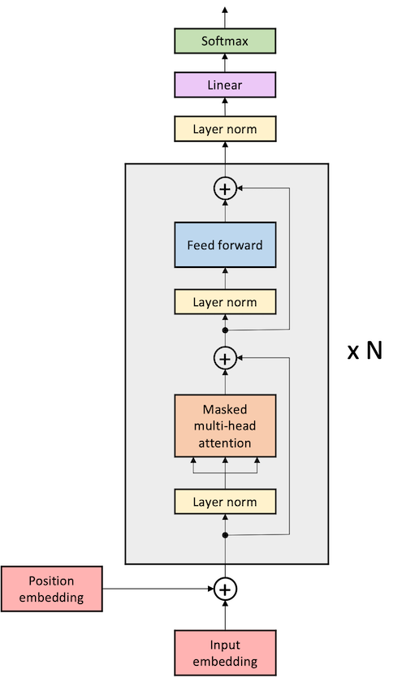

# GPT-2 language models

This directory contains the Pytorch ML reference for GPT-2 model.

## List of topics

- [GPT-2 language models](#gpt-2-language-models)
  - [Overview of the model](#overview-of-the-model)
    - [GPT-2](#gpt-2)
  - [Steps for running model training](#steps-for-running-model-training)
  - [Structure of the code](#structure-of-the-code)
- [Download and prepare the dataset](#download-and-prepare-the-dataset)
  - [Download](#download)
    - [OpenWebText dataset](#openwebtext-dataset)
      - [GPT-2 DataProcessor output](#gpt-2-dataprocessor-output)
  - [GPT-2 input function](#gpt-2-input-function)
      - [GPT-2 features dictionary](#gpt-2-features-dictionary)
- [How to run](#how-to-run)
  - [To compile/validate, run train and eval on Cerebras System](#to-compilevalidate-run-train-and-eval-on-cerebras-system)
  - [To run train and eval on GPU/CPU](#to-run-train-and-eval-on-gpucpu)
  - [Configurations included for this model](#configurations-included-for-this-model)
  - [References](#references)

## Overview of the model

### GPT-2

GPT-2 is a decoder-only transformer-based model designed by OpenAI.
It uses a stack of transformer blocks with dot-product
self-attention followed by a multi-layer perceptron feed-forward network.



-   **Autoregressive language modeling**: The model predicts the next token from
the prior context at every position in the sequence (compare to [BERT](https://arxiv.org/abs/1810.04805), which uses an autoencoding
loss that predicts masked positions from the rest of the unmasked sequence).
Autoregressive language modeling requires masking the future positions in the
sequence.
-   **Layer norms** in the transformer blocks are **located inside the residual
connections** ahead of the self-attention or feed-forward network
(compare to [BERT](https://arxiv.org/abs/1810.04805) and [GPT](https://s3-us-west-2.amazonaws.com/openai-assets/research-covers/language-unsupervised/language_understanding_paper.pdf), which have layer norms outside of the residual block).
The GPT-2 layer norm location has the effect of allowing transformer block to elongate token
embeddings through the depth of the model (i.e., maybe more representational capacity).
-   GPT-2 does not add any auxiliary losses (compare to [BERT](https://arxiv.org/abs/1810.04805), which uses next sentence prediction
(NSP), or [ALBERT](https://arxiv.org/abs/1909.11942) which uses sentence-order prediction (SOP)).

GPT-2 with `48`-layers, and a total of `1542M` parameters, has more than an order of magnitude more
parameters than GPT.

**Reference**: Radford, A. et al. (2019). [Language Models are Unsupervised Multitask Learners](https://d4mucfpksywv.cloudfront.net/better-language-models/language-models.pdf).

## Steps for running model training
In order to run any of the models in this directory, you must go through the following steps:
- Download and preprocess the data (see [Prepare the data](#prepare-the-data) for more details)
- Run training for your desired model (see [Run pre-training](#run-pre-training))

## Structure of the code

-   `configs/`: YAML configuration files.
-   `model.py`: The entry point to the model. Defines `Gpt2Model` which supports GPT-2.
-   `run.py`: Training script. Performs training and validation.
-   `utils.py`: Miscellaneous scripts to parse the `params` dictionary from the YAML files.

# Download and prepare the dataset

## Download

### OpenWebText dataset

You need to download raw OWT data following [these instructions](../../../data_preparation/nlp/owt) and create preprocessed dataset files using [`preprocess_data.py`](../../../data_preparation/data_preprocessing/preprocess_data.py).

## GPT-2 input function

If you want to use your own data loader with this example code, then this section describes the input data format expected by `Gpt2Model` class defined in [model.py](./model.py). The `Gpt2Model` supports GPT-2.

When you create your own custom GPT input function, you must ensure that your GPT input function produces a features dictionary as described in this section.

We recommended using [GptHDF5DataProcessor](../../../data/nlp/gpt/GptHDF5DataProcessor.py) for the input function of GPT-2 model (for performance reasons). The instructions to create a HDF5 dataset can be found here: [Data Preprocessing](https://docs.cerebras.net/en/latest/wsc/Model-zoo/Components/Data-preprocessing/data_preprocessing.html). We also support the following Data Processors:

- [HuggingFaceDataProcessorEli5](./../../../data/nlp/gpt/HuggingFaceDataProcessorEli5.py): An example of using HuggingFace Eli5 dataset (Map-Style).
- [HuggingFaceIterableDataProcessorEli5](./../../../data/nlp/gpt/HuggingFaceIterableDataProcessorEli5.py): An example of using HuggingFace Eli5 dataset (Iterable).
- [DummyDataProcessor](./../../../data/nlp/gpt/DummyDataProcessor.py): An example of using an arbitrary Map-Style PyTorch dataset.
- [DummyIterableDataProcessor](./../../../data/nlp/gpt/DummyIterableDataProcessor.py): An example of using an arbitrary Iterable PyTorch dataset.

> **NOTE**: More information on using of HuggingFace datasets can be found in this document: [Using HuggingFace datasets for auto-regressive LM](../../../data_preparation/huggingface/README.md)

#### GPT-2 features dictionary

The features dictionary has the following key/values:

- `input_ids`: Input token IDs, padded with `0` to `max_sequence_length`.
  - Shape: `(batch_size, max_sequence_length)`
  - Type: `torch.int32`
- `attention_mask`: Mask for padded positions. Has values `0` on the padded positions and `1` elsewhere.
  - Shape: `(batch_size, max_sequence_length)`
  - Type: `torch.int32`
- `labels`: Labels for language modeling pre-training task, padded with `0` to `max_sequence_length`.
  - Shape: `(batch_size, max_sequence_length)`
  - Type: `torch.int32`

# How to run

**IMPORTANT**: See the following notes before proceeding further.

**Parameter settings in YAML config file**: The config YAML files are located in the [configs](configs/) directory. Before starting a pre-training run, make sure that in the YAML config file you are using:

-   The `train_input.data_dir` parameter points to the correct dataset, and
-   The `train_input.max_sequence_length` parameter corresponds to the sequence length of the dataset.
-   The `model.max_position_embeddings` parameter corresponds to the maximum dimension of position embeddings.

**YAML config files**: Details on the configs for this model can be found in [Configs included for this model](#configs-included-for-this-model)

In the following example run commands, we use `/path/to/yaml`, `/path/to/model_dir`, and `train` as placeholders for user supplied inputs.

-   `/path/to/yaml` is a path to the YAML config file with model parameters such one of the configurations described in [Configs included for this model](#configs-included-for-this-model).
-   `/path/to/model_dir` is a path to the directory where you would like to store the logs and other artifacts of the run.
-   `--mode` specifies the desired mode to run the model in. Change to `--mode eval` to run in eval mode.

## To compile/validate, run train and eval on Cerebras System

Please follow the instructions on our [quickstart in the Developer Docs](https://docs.cerebras.net/en/latest/wsc/getting-started/cs-appliance.html).

## To run train and eval on GPU/CPU

If running on a cpu or gpu, activate the environment from [Python GPU Environment setup](../../../../../../PYTHON-SETUP.md), and simply run:

```
python run.py {CPU,GPU} --mode train --params /path/to/yaml --model_dir /path/to/model_dir
```

## Configurations included for this model

In order to train the model, you need to provide a yaml config file. Some popular yaml [configs](configs/) files are listed below for reference. Also, feel free to create your own following these examples:

Configs below are meant to be run on [Pipeline mode](https://docs.cerebras.net/en/latest/wsc/cerebras-basics/cerebras-execution-modes.html#layer-pipelined-mode)

- [params_gpt2_small.yaml](./configs/params_gpt2_small.yaml) have the standard gpt2-base config with `hidden_size=768`, `num_hidden_layers=12`, `num_heads=12`, for Weight Streaming mode.
- [params_gpt2_medium.yaml](./configs/params_gpt2_medium.yaml): A 345M parameter model with the standard gpt2-medium config with `hidden_size=1024`, `num_hidden_layers=24`, `num_heads=16`.
- [params_gpt2_large.yaml](./configs/params_gpt2_large.yaml): A 774M parameter model with the standard gpt2-large config with `hidden_size=1280`, `num_hidden_layers=36`, `num_heads=20`.
- [params_gpt2_xl.yaml](./configs/params_gpt2_xl.yaml): A 1.3B parameter model with the standard gpt2-xl config with `hidden_size=1600`, `num_hidden_layers=48`, `num_heads=16`.

## References

**Reference**: Radford, A. et al. (2019). [Language Models are Unsupervised Multitask Learners](https://d4mucfpksywv.cloudfront.net/better-language-models/language-models.pdf).
